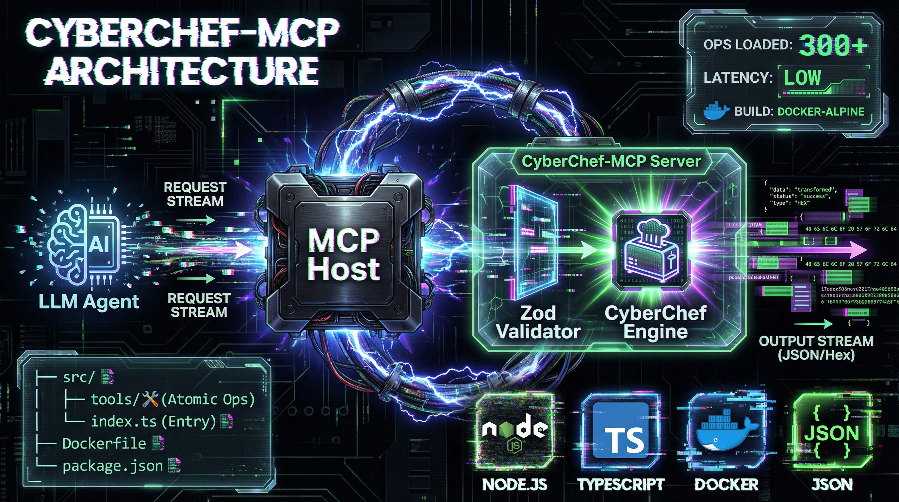
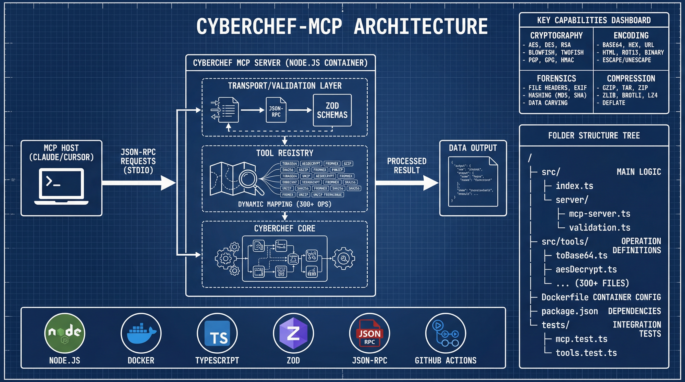

# CyberChef MCP Server

This project provides a **Model Context Protocol (MCP)** server interface for **CyberChef**, the "Cyber Swiss Army Knife" created by [GCHQ](https://github.com/gchq/CyberChef).

By running this server, you enable AI assistants (like Claude, Cursor AI, and others) to natively utilize CyberChef's extensive library of 463 data manipulation operations—including encryption, encoding, compression, and forensic analysis—as executable tools.

**Latest Release:** v1.7.3 | [Release Notes](docs/releases/v1.7.3.md) | [Security Policy](SECURITY.md) | [Security Fixes Report](docs/security/SECURITY_FIX_REPORT.md)



[](https://modelcontextprotocol.io/)
[](LICENSE)
[](https://github.com/doublegate/CyberChef-MCP/releases)
[](https://nodejs.org/)
[](https://github.com/doublegate/CyberChef-MCP/actions/workflows/security-scan.yml)
[](https://codecov.io/gh/doublegate/CyberChef-MCP)

## Project Context

**CyberChef** is a simple, intuitive web app for carrying out all manner of "cyber" operations within a web browser. It was originally conceived and built by [GCHQ](https://github.com/gchq/CyberChef).

This fork wraps the core CyberChef Node.js API into an MCP server, bridging the gap between natural language AI intent and deterministic data processing.

### Fork Relationship

This project maintains a selective sync relationship with the upstream GCHQ/CyberChef repository:
- **Core Operations**: Synced from upstream (`src/core/operations/*.mjs`) via automated workflows
- **Web UI Components**: Removed (88 files, ~19,260 lines) - not needed for MCP server
- **MCP-Specific Code**: Custom implementation (`src/node/mcp-server.mjs`, tests, workflows)
- **Sync Model**: Selective file copying, NOT git merge, to preserve MCP-specific modifications

See [Upstream Sync Guide](docs/guides/upstream-sync-guide.md) for details on the synchronization process.



## Features

### MCP Tools
The server exposes CyberChef operations as MCP tools:

*   **`cyberchef_bake`**: The "Omni-tool". Executes a full CyberChef recipe (a chain of operations) on an input. Ideal for complex, multi-step transformations (e.g., "Decode Base64, then Gunzip, then prettify JSON").
*   **Atomic Operations**: 463 individual tools for specific tasks, dynamically generated from the CyberChef configuration.
    *   `cyberchef_to_base64` / `cyberchef_from_base64`
    *   `cyberchef_aes_decrypt`
    *   `cyberchef_sha2`
    *   `cyberchef_yara_rules`
    *   ...and hundreds more.
*   **`cyberchef_search`**: A utility tool to help the AI discover available operations and their descriptions.
*   **Recipe Management** (v1.6.0): 10 tools for saving, organizing, and reusing multi-operation workflows
    *   `cyberchef_recipe_create` / `cyberchef_recipe_get` / `cyberchef_recipe_list`
    *   `cyberchef_recipe_update` / `cyberchef_recipe_delete` / `cyberchef_recipe_execute`
    *   `cyberchef_recipe_export` / `cyberchef_recipe_import`
    *   `cyberchef_recipe_validate` / `cyberchef_recipe_test`
*   **Advanced Features** (v1.7.0): 5 new tools for enterprise-grade capabilities
    *   `cyberchef_batch` - Execute multiple operations in parallel or sequential mode
    *   `cyberchef_telemetry_export` - Privacy-first usage analytics (opt-in)
    *   `cyberchef_cache_stats` / `cyberchef_cache_clear` - Cache inspection and management
    *   `cyberchef_quota_info` - Resource quota and usage tracking

### Technical Highlights
*   **Dockerized**: Runs as a lightweight, self-contained Docker container based on Chainguard distroless Node.js 22 (~90MB compressed, 70% smaller attack surface than traditional images).
*   **Dual-Registry Publishing**: Images published to both Docker Hub and GitHub Container Registry (GHCR) for maximum accessibility and Docker Scout health score optimization.
*   **Supply Chain Attestations**: SBOM and provenance attestations attached to Docker Hub images for enhanced security transparency and compliance (SLSA Build Level 3).
*   **Stdio Transport**: Communicates via standard input/output, making it easy to integrate with CLI-based MCP clients.
*   **Schema Validation**: All inputs are validated against schemas derived from CyberChef's internal type system using `zod`.
*   **Modern Node.js**: Fully compatible with Node.js v22+ with automated compatibility patches.
*   **Recipe Management** (v1.6.0): Save and reuse multi-operation workflows with full CRUD operations, import/export in multiple formats (JSON/YAML/URL/CyberChef), recipe composition with nesting support, and curated library of 25+ production-ready recipes across 5 categories. See [Recipe Management Guide](docs/guides/recipe_management.md) for details.
*   **Advanced Features** (v1.7.0): Enterprise-grade capabilities with batch processing (parallel/sequential execution of up to 100 operations), privacy-first telemetry collection (disabled by default, no input/output data captured), sliding window rate limiting for resource protection, enhanced caching with inspection tools, and resource quota tracking (concurrent operations, data sizes). All features are configurable via environment variables with secure defaults. See [Release Notes](docs/releases/v1.7.0.md) for details.
*   **Enhanced Observability** (v1.5.0): Structured JSON logging with Pino for production monitoring, comprehensive error handling with actionable recovery suggestions, automatic retry logic with exponential backoff, request correlation with UUID tracking, circuit breaker pattern for cascading failure prevention, and streaming infrastructure for progressive results on large operations. See [Release Notes](docs/releases/v1.5.0.md) for details.
*   **Performance Optimized** (v1.4.0): LRU cache for operation results (100MB default), automatic streaming for large inputs (10MB+ threshold), configurable resource limits (100MB max input, 30s timeout), memory monitoring, and comprehensive benchmark suite. See [Performance Tuning Guide](docs/architecture/performance-tuning.md) for configuration options.
*   **Upstream Sync Automation** (v1.3.0): Automated monitoring of upstream CyberChef releases every 6 hours, one-click synchronization workflow, comprehensive validation test suite with 493 tests, and emergency rollback mechanism.
*   **Security Hardened** (v1.4.5+): Chainguard distroless base image with zero-CVE baseline, non-root execution (UID 65532), automated Trivy vulnerability scanning with build-fail thresholds, dual SBOM strategy (Docker Scout attestations + CycloneDX), read-only filesystem support, SLSA Build Level 3 provenance, and 7-day SLA for critical CVE patches. Fixed 11 of 12 code scanning vulnerabilities including critical cryptographic randomness weakness and 7 ReDoS vulnerabilities. See [Security Policy](SECURITY.md) and [Security Fixes Report](docs/security/SECURITY_FIX_REPORT.md) for details.
*   **Production Ready**: Comprehensive CI/CD with CodeQL v4, automated testing, and dual-registry container publishing (Docker Hub + GHCR) with complete supply chain attestations.

## Quick Start

### Prerequisites
*   **Docker** installed and running.

### Installation Options

**Option 1: Pull from Docker Hub (Online, Recommended)**
```bash
# Docker Hub provides health scores and supply chain attestations
docker pull doublegate/cyberchef-mcp:latest
docker tag doublegate/cyberchef-mcp:latest cyberchef-mcp
docker run -i --rm cyberchef-mcp
```

**Option 1b: Pull from GitHub Container Registry (Alternative)**
```bash
docker pull ghcr.io/doublegate/cyberchef-mcp_v1:latest
docker tag ghcr.io/doublegate/cyberchef-mcp_v1:latest cyberchef-mcp
docker run -i --rm cyberchef-mcp
```

**Option 2: Download Pre-built Image (Offline Installation)**

For environments without direct GHCR access, download the pre-built Docker image tarball from the [latest release](https://github.com/doublegate/CyberChef-MCP/releases/latest):

1.  **Download the tarball** (approximately 90MB compressed):
    ```bash
    # Download from GitHub Releases
    wget https://github.com/doublegate/CyberChef-MCP/releases/download/v1.7.3/cyberchef-mcp-v1.7.3-docker-image.tar.gz
    ```

2.  **Load the image into Docker:**
    ```bash
    docker load < cyberchef-mcp-v1.7.3-docker-image.tar.gz
    ```

3.  **Tag for easier usage:**
    ```bash
    docker tag ghcr.io/doublegate/cyberchef-mcp_v1:v1.7.3 cyberchef-mcp
    ```

4.  **Run the server:**
    ```bash
    docker run -i --rm cyberchef-mcp
    ```

**Option 3: Build from Source**
1.  **Clone the Repository:**
    ```bash
    git clone https://github.com/doublegate/CyberChef-MCP.git
    cd CyberChef-MCP
    ```

2.  **Build the Docker Image:**
    ```bash
    docker build -f Dockerfile.mcp -t cyberchef-mcp .
    ```

3.  **Run the Server (Interactive Mode):**
    This command starts the server and listens on stdin. This is what your MCP client will run.
    ```bash
    docker run -i --rm cyberchef-mcp
    ```

4.  **Optional: Run with Enhanced Security (Read-Only Filesystem):**
    For maximum security in production deployments:
    ```bash
    docker run -i --rm --read-only --tmpfs /tmp:rw,noexec,nosuid,size=100m cyberchef-mcp
    ```

## Client Configuration

### Cursor AI
1.  Go to **Settings** > **Features** > **MCP**.
2.  Add a new server:
    *   **Name:** `CyberChef`
    *   **Type:** `command`
    *   **Command:** `docker`
    *   **Args:** `run -i --rm cyberchef-mcp`

### Claude Code (CLI)
Add to your configuration file (typically `~/.config/claude/config.json`):
```json
{
  "mcpServers": {
    "cyberchef": {
      "command": "docker",
      "args": ["run", "-i", "--rm", "cyberchef-mcp"]
    }
  }
}
```

### Claude Desktop
Add to your Claude Desktop configuration file:
*   **macOS:** `~/Library/Application Support/Claude/claude_desktop_config.json`
*   **Windows:** `%APPDATA%/Claude/claude_desktop_config.json`

```json
{
  "mcpServers": {
    "cyberchef": {
      "command": "docker",
      "args": ["run", "-i", "--rm", "cyberchef-mcp"]
    }
  }
}
```

After adding the configuration, restart Claude Desktop. The CyberChef tools will appear in the available tools panel.

## Performance & Configuration

Version 1.4.0 introduces comprehensive performance optimizations and configurable resource limits. All features can be tuned via environment variables for your deployment needs.

### Performance Features

**LRU Cache for Operation Results**
- Automatically caches operation results to eliminate redundant computation
- Configurable cache size (100MB default) and item count (1000 default)
- Cache keys based on operation + input + arguments (SHA256 hash)

**Automatic Streaming for Large Inputs**
- Inputs exceeding 10MB automatically use chunked processing
- Supports encoding, compression, and hashing operations
- Memory-efficient handling of 100MB+ files
- Transparent fallback for non-streaming operations

**Resource Limits**
- Maximum input size validation (100MB default)
- Operation timeout enforcement (30 seconds default)
- Prevents out-of-memory crashes and runaway operations

**Memory Monitoring**
- Periodic memory usage logging to stderr
- Heap and RSS tracking for troubleshooting

### Configuration Options

All features are configurable via environment variables:

```bash
# Logging (v1.5.0+)
LOG_LEVEL=info                           # Logging level: debug, info, warn, error, fatal

# Retry Logic (v1.5.0+)
CYBERCHEF_MAX_RETRIES=3                  # Maximum retry attempts for transient failures
CYBERCHEF_INITIAL_BACKOFF=1000           # Initial backoff delay in milliseconds
CYBERCHEF_MAX_BACKOFF=10000              # Maximum backoff delay in milliseconds
CYBERCHEF_BACKOFF_MULTIPLIER=2           # Backoff multiplier for exponential backoff

# Streaming (v1.5.0+)
CYBERCHEF_STREAM_CHUNK_SIZE=1048576      # Chunk size for streaming (1MB)
CYBERCHEF_STREAM_PROGRESS_INTERVAL=10485760  # Progress reporting interval (10MB)

# Recipe Management (v1.6.0+)
CYBERCHEF_RECIPE_STORAGE=./recipes.json  # Storage file path
CYBERCHEF_RECIPE_MAX_COUNT=10000         # Maximum number of recipes
CYBERCHEF_RECIPE_MAX_OPERATIONS=100      # Max operations per recipe
CYBERCHEF_RECIPE_MAX_DEPTH=5             # Max nesting depth

# Batch Processing (v1.7.0+)
CYBERCHEF_BATCH_MAX_SIZE=100             # Maximum operations per batch
CYBERCHEF_BATCH_ENABLED=true             # Enable/disable batch processing

# Telemetry & Analytics (v1.7.0+)
CYBERCHEF_TELEMETRY_ENABLED=false        # Privacy-first: disabled by default

# Rate Limiting (v1.7.0+)
CYBERCHEF_RATE_LIMIT_ENABLED=false       # Disabled by default
CYBERCHEF_RATE_LIMIT_REQUESTS=100        # Max requests per window
CYBERCHEF_RATE_LIMIT_WINDOW=60000        # Time window in milliseconds

# Cache Management (v1.7.0+)
CYBERCHEF_CACHE_ENABLED=true             # Enable/disable caching

# Resource Quotas (v1.7.0+)
CYBERCHEF_MAX_CONCURRENT_OPS=10          # Maximum concurrent operations

# Performance (v1.4.0+)
CYBERCHEF_MAX_INPUT_SIZE=104857600       # Maximum input size (100MB)
CYBERCHEF_OPERATION_TIMEOUT=30000        # Operation timeout in milliseconds (30s)
CYBERCHEF_STREAMING_THRESHOLD=10485760   # Streaming threshold (10MB)
CYBERCHEF_ENABLE_STREAMING=true          # Enable streaming for large operations
CYBERCHEF_ENABLE_WORKERS=false           # Enable worker threads (disabled by default, not yet implemented)
CYBERCHEF_CACHE_MAX_SIZE=104857600       # Cache maximum size (100MB)
CYBERCHEF_CACHE_MAX_ITEMS=1000           # Cache maximum items
```

### Example Configurations

**High-Throughput Server (Large Files)**
```bash
docker run -i --rm --memory=4g \
  -e CYBERCHEF_MAX_INPUT_SIZE=524288000 \
  -e CYBERCHEF_STREAMING_THRESHOLD=52428800 \
  -e CYBERCHEF_CACHE_MAX_SIZE=524288000 \
  -e CYBERCHEF_OPERATION_TIMEOUT=120000 \
  ghcr.io/doublegate/cyberchef-mcp_v1:latest
```

**Low-Memory Environment**
```bash
docker run -i --rm --memory=512m \
  -e CYBERCHEF_MAX_INPUT_SIZE=10485760 \
  -e CYBERCHEF_STREAMING_THRESHOLD=5242880 \
  -e CYBERCHEF_CACHE_MAX_SIZE=10485760 \
  -e CYBERCHEF_CACHE_MAX_ITEMS=100 \
  ghcr.io/doublegate/cyberchef-mcp_v1:latest
```

**Claude Desktop with Custom Limits**
```json
{
  "mcpServers": {
    "cyberchef": {
      "command": "docker",
      "args": [
        "run", "-i", "--rm",
        "-e", "CYBERCHEF_MAX_INPUT_SIZE=209715200",
        "-e", "CYBERCHEF_CACHE_MAX_SIZE=209715200",
        "ghcr.io/doublegate/cyberchef-mcp_v1:latest"
      ]
    }
  }
}
```

**Debug Logging for Troubleshooting (v1.5.0+)**
```bash
docker run -i --rm \
  -e LOG_LEVEL=debug \
  -e CYBERCHEF_MAX_RETRIES=5 \
  ghcr.io/doublegate/cyberchef-mcp_v1:latest
```

For detailed performance tuning guidance, see the [Performance Tuning Guide](docs/architecture/performance-tuning.md).

### Performance Benchmarks

Run the benchmark suite to measure performance on your hardware:

```bash
# Install dependencies
npm install

# Generate required configuration
npx grunt configTests

# Run benchmarks
npm run benchmark
```

The benchmark suite tests 20+ operations across multiple input sizes (1KB, 10KB, 100KB) in categories including:
- Encoding operations (Base64, Hex)
- Hashing operations (MD5, SHA256, SHA512)
- Compression operations (Gzip)
- Cryptographic operations (AES)
- Text operations (Regex)
- Analysis operations (Entropy, Frequency Distribution)

## Security

This project implements comprehensive security hardening with continuous improvements:

### Latest Enhancements (v1.6.0)
*   **Recipe Management System**: Save, organize, and reuse multi-operation workflows
    *   **CRUD Operations**: Create, read, update, delete recipes with versioning
    *   **Import/Export**: JSON, YAML, URL, and CyberChef format support
    *   **Recipe Composition**: Nest recipes within recipes for complex workflows
    *   **Recipe Library**: 25+ curated examples in 5 categories (Cryptography, Encoding, Data Extraction, Forensics, Networking)
    *   **Validation Tools**: Pre-execution validation with complexity estimation
    *   **Testing Tools**: Test recipes with sample inputs before deployment
    *   **10 New MCP Tools**: Complete recipe lifecycle management
    *   See [Recipe Management Guide](docs/guides/recipe_management.md) for complete usage documentation

### Enhanced Observability (v1.5.0)
*   **Enhanced Error Handling**: Comprehensive error reporting for production debugging
    *   **8 Error Codes**: Standardized error classification (INVALID_INPUT, MISSING_ARGUMENT, OPERATION_FAILED, TIMEOUT, OUT_OF_MEMORY, UNSUPPORTED_OPERATION, CACHE_ERROR, STREAMING_ERROR)
    *   **Rich Context**: Detailed debugging information (input size, operation name, request ID, timestamp)
    *   **Recovery Suggestions**: Actionable recommendations for common issues
    *   **Retryable Classification**: Automatic distinction between transient and permanent failures
*   **Structured Logging with Pino**: Production-ready observability
    *   **JSON Logs**: Machine-readable logs for monitoring tools (Datadog, Splunk, ELK)
    *   **Request Correlation**: UUID-based request tracking across operations
    *   **Performance Metrics**: Duration, throughput, cache hits, memory usage
    *   **Configurable Levels**: debug, info, warn, error, fatal via LOG_LEVEL environment variable
*   **Automatic Retry Logic**: Resilience for transient failures
    *   **Exponential Backoff**: 1s → 2s → 4s with jitter to prevent thundering herd
    *   **Configurable Retries**: Default 3 attempts, customizable via CYBERCHEF_MAX_RETRIES
    *   **Smart Detection**: Automatically retries timeouts, memory issues, network errors
    *   **Circuit Breaker**: Opens after 5 consecutive failures to prevent cascading issues
*   **MCP Streaming Infrastructure**: Progressive results for large operations
    *   **Chunked Processing**: Memory-efficient handling of 100MB+ inputs
    *   **Progress Reporting**: Updates every 10MB for long-running operations
    *   **14 Supported Operations**: Encoding (Base64, Hex), hashing (MD5, SHA family), text operations
    *   **Configurable Thresholds**: Streaming chunk size and progress interval

### Security Hardening (v1.4.6)
*   **Chainguard Distroless Base Image**: Enterprise-grade container security
    *   **Zero-CVE Baseline**: Daily security updates with 7-day SLA for critical patches
    *   **70% Smaller Attack Surface**: Minimal OS footprint compared to traditional Alpine/Debian images
    *   **Non-Root Execution**: Runs as UID 65532 (nonroot user) in distroless environment
    *   **SLSA Build Level 3 Provenance**: Verifiable supply chain integrity
    *   **Multi-stage Build**: `-dev` variant for compilation, distroless runtime for production
*   **Read-Only Filesystem Support**: Production-ready immutable deployments
    *   Supports `docker run --read-only` with tmpfs mount for /tmp
    *   Compliance-ready for PCI-DSS, SOC 2, FedRAMP requirements
    *   Example: `docker run -i --rm --read-only --tmpfs /tmp:rw,noexec,nosuid,size=100m cyberchef-mcp`
*   **Security Scan Fail Thresholds**: Automated vulnerability prevention
    *   Trivy scanner configured with `exit-code: '1'` in CI/CD
    *   Builds automatically fail on CRITICAL or HIGH vulnerabilities
    *   Prevents vulnerable images from reaching production
*   **Dual SBOM Strategy**: Comprehensive supply chain transparency
    *   **Part 1**: Docker buildx attestations for automated registry scanning (Docker Scout)
    *   **Part 2**: Trivy CycloneDX SBOM for offline compliance auditing
    *   Both SBOMs attached as release assets for verification

### Code Security (v1.4.1+)
*   **11 of 12 Code Scanning Vulnerabilities Fixed**: Comprehensive security hardening completed
    *   **CRITICAL**: Fixed insecure cryptographic randomness in GOST library - replaced `Math.random()` with `crypto.randomBytes()`
    *   **HIGH**: Eliminated 7 ReDoS (Regular Expression Denial of Service) vulnerabilities across 6 operations
    *   **NEW MODULE**: SafeRegex.mjs provides centralized validation for all user-controlled regex patterns
        *   Pattern length limits (10,000 characters)
        *   ReDoS pattern detection (nested quantifiers, overlapping alternations)
        *   Timeout-based validation (100ms) to detect catastrophic backtracking
        *   XRegExp and standard RegExp support
*   **All 1,933 Tests Passing**: Security fixes validated with comprehensive test suite
*   See [Security Fixes Report](docs/security/SECURITY_FIX_REPORT.md) for complete details

### Supply Chain Security (v1.4.5+)
*   **Dual-Registry Publishing with Attestations**: Enhanced security transparency and compliance
    *   **Docker Hub**: Primary distribution with Docker Scout health score monitoring
    *   **GitHub Container Registry (GHCR)**: Secondary distribution for GitHub ecosystem integration
    *   Both registries receive identical images with full attestation support
*   **Docker Scout Attestations**: Build integrity and software transparency
    *   **Provenance Attestation** (mode=max): Complete build process metadata (builder, materials, recipe) for SLSA Build Level 3 compliance
    *   **SBOM Attestation**: Automatic Software Bill of Materials generation in SPDX-JSON format
    *   Achieves optimal Docker Scout health score (grade A or B) on Docker Hub
    *   15 points out of 100 in health score calculation - one of the highest-weighted policy categories
*   **Dual SBOM Strategy**: Comprehensive software transparency
    *   **Docker Attestation SBOM**: Attached to image manifest for registry-based validation and `docker sbom` command
    *   **Trivy SBOM Artifact**: Standalone CycloneDX file for offline audits and compliance reporting
    *   Both SBOMs include complete dependency tree with version information
*   **Trivy Integration**: Container and dependency scanning on every build with fail-fast thresholds
*   **GitHub Security Tab**: All findings automatically uploaded as SARIF
*   **Verification**: Use `docker scout quickview` and `docker sbom` commands to inspect attestations locally

### Container Security (v1.4.5+)
*   **Chainguard Distroless**: Zero-CVE baseline with minimal attack surface
*   **Non-Root Execution**: Container runs as UID 65532 (nonroot user in distroless)
*   **Read-Only Filesystem**: Supports `--read-only` flag for immutable deployments
*   **Minimal Attack Surface**: No shell, no package manager, only runtime dependencies
*   **Health Checks**: Built-in container health monitoring

### Cryptographic Hardening (v1.2.5)
*   **Argon2 OWASP Compliance**: Default parameters follow OWASP 2024-2025 recommendations
    *   Type: Argon2id (hybrid side-channel + GPU resistance)
    *   Memory: 19 MiB (OWASP minimum)
    *   Iterations: 2 (OWASP recommended for 19 MiB)
*   **Secure Random Number Generation**: All cryptographic operations use `crypto.randomBytes()` or `crypto.getRandomValues()`
*   **CVE-2025-64756 Fixed**: Updated npm to resolve glob command injection vulnerability

### Automated Security Scanning
*   **CodeQL Analysis**: Continuous code scanning for security vulnerabilities
*   **Weekly Scans**: Scheduled scans catch newly discovered vulnerabilities

### Secure Deployment
```bash
# Recommended: Run with maximum security options (Chainguard distroless)
docker run -i --rm \
  --read-only \
  --tmpfs /tmp:rw,noexec,nosuid,size=100m \
  --cap-drop=ALL \
  --security-opt=no-new-privileges \
  cyberchef-mcp

# Note: Chainguard distroless already runs as non-root (UID 65532)
# --read-only requires tmpfs mount for /tmp directory
```

For detailed information, see:
*   [Security Policy](SECURITY.md) - Vulnerability reporting and security policies
*   [Security Audit](docs/security/audit.md) - Comprehensive security assessment
*   [Security Fixes Report](docs/security/SECURITY_FIX_REPORT.md) - Latest vulnerability fixes
*   [Security Fixes Summary](docs/security/SECURITY_FIXES_SUMMARY.md) - Quick reference guide

## Project Roadmap

CyberChef MCP Server has a comprehensive development roadmap spanning **19 releases** across **6 phases** through August 2027.

| Phase | Releases | Timeline | Focus | Status |
|-------|----------|----------|-------|--------|
| **Phase 1: Foundation** | v1.2.0 - v1.4.6 | Q4 2025 - Q1 2026 | Security hardening, upstream sync, performance | **Completed** |
| **Phase 2: Enhancement** | v1.5.0 - v1.7.3 | Q2 2026 | Streaming, recipe management, batch processing | **v1.7.3 Released** |
| **Phase 3: Maturity** | v1.8.0 - v2.0.0 | Q3 2026 | API stabilization, external tool integration, v2.0.0 | **Planning Complete** |
| **Phase 4: Expansion** | v2.1.0 - v2.3.0 | Q4 2026 | Multi-modal, advanced transports, plugins | Planned |
| **Phase 5: Enterprise** | v2.4.0 - v2.6.0 | Q1 2027 | OAuth 2.1, RBAC, Kubernetes, observability | Planned |
| **Phase 6: Evolution** | v2.7.0 - v3.0.0 | Q2-Q3 2027 | Edge deployment, AI-native features, v3.0.0 | Planned |

**v2.0.0 Planning:** Comprehensive external project integration planning is now complete with 30 planning documents covering 80-120 new MCP tools from 8 security tool projects (Ciphey, cryptii, xortool, RsaCtfTool, John the Ripper, pwntools, katana, cyberchef-recipes). See [External Project Integration](docs/planning/ext-proj-int/) for details.

See the [**Full Roadmap**](docs/planning/ROADMAP.md) for detailed release plans and timelines.

## Documentation

Detailed documentation is organized in the [`docs/`](docs/) directory:

### User Guides
*   [**User Guide**](docs/guides/user_guide.md): Detailed installation and client configuration
*   [**Commands Reference**](docs/guides/commands.md): List of all available MCP tools and operations
*   [**Recipe Management Guide**](docs/guides/recipe_management.md): Complete guide to saving, organizing, and reusing workflows
*   [**Upstream Sync Guide**](docs/guides/upstream-sync-guide.md): Guide to selective upstream synchronization workflow
*   [**Docker Hub Setup Guide**](docs/guides/DOCKER_HUB_SETUP.md): Quick start guide for Docker Hub publishing and attestations
*   [**Docker Scout Attestations Guide**](docs/guides/docker-scout-attestations.md): Comprehensive guide to supply chain attestations and health scores

### Development Guides
*   [**Codecov Integration Guide**](docs/guides/codecov-integration.md): Coverage analytics, bundle analysis, and test analytics

### Technical Documentation
*   [**Architecture**](docs/architecture/architecture.md): Technical design of the MCP server
*   [**Technical Implementation**](docs/architecture/technical_implementation.md): Implementation details
*   [**Performance Tuning Guide**](docs/architecture/performance-tuning.md): Configuration guide for optimizing performance

### Project Management
*   [**Product Roadmap**](docs/planning/ROADMAP.md): Comprehensive v1.1.0 → v3.0.0 roadmap with timeline
*   [**Tasks**](docs/planning/tasks.md): 500+ implementation tasks organized by release
*   [**Development Phases**](docs/planning/phases/overview.md): Sprint breakdowns for each development phase
*   [**Release Plans**](docs/planning/future-releases/): Individual release specifications (v1.2.0 - v3.0.0)
*   [**Project Summary**](docs/internal/project_summary.md): Internal project overview

### Strategic Planning
*   [**Upstream Sync Strategy**](docs/planning/strategies/UPSTREAM-SYNC-STRATEGY.md): Automated CyberChef update monitoring
*   [**Security Hardening Plan**](docs/planning/strategies/SECURITY-HARDENING-PLAN.md): Docker DHI, non-root, SBOM generation
*   [**Multi-Modal Strategy**](docs/planning/strategies/MULTI-MODAL-STRATEGY.md): Image/binary/audio handling via MCP
*   [**Plugin Architecture**](docs/planning/strategies/PLUGIN-ARCHITECTURE-DESIGN.md): Custom operations and sandboxed execution
*   [**Enterprise Features**](docs/planning/strategies/ENTERPRISE-FEATURES-PLAN.md): OAuth 2.1, RBAC, audit logging

### v2.0.0 Integration Planning
*   [**External Project Integration**](docs/planning/ext-proj-int/): Comprehensive planning for v2.0.0+ integrations
    *   [Overview](docs/planning/ext-proj-int/overview.md): Integration strategy and architecture (4 phases, 12 sprints, 80-120 new tools)
    *   [Phase Plans](docs/planning/ext-proj-int/phases/): Foundation, JavaScript Native, Algorithm Ports, Advanced
    *   [Sprint Plans](docs/planning/ext-proj-int/sprints/): 12 detailed sprint breakdowns with task lists
    *   [Tool Integration Plans](docs/planning/ext-proj-int/tools/): Per-tool integration strategies (Ciphey, cryptii, xortool, RsaCtfTool, John, pwntools, katana, recipes)
    *   [Technical Guides](docs/planning/ext-proj-int/technical/): Tool registration, algorithm porting, testing, dependencies

### Reference Documentation
*   [**Security Tool Reference**](docs/reference/): Technical documentation for 11 security tools and related projects
    *   [ares](docs/reference/ares.md), [ciphey](docs/reference/ciphey.md): Auto-decode tools and algorithms
    *   [cryptii](docs/reference/cryptii.md): Modular encoding/decoding system
    *   [cyberchef-recipes](docs/reference/cyberchef-recipes.md), [cyberchef-server](docs/reference/cyberchef-server.md): Related CyberChef projects
    *   [john-the-ripper](docs/reference/john-the-ripper.md): Password cracking and hash identification
    *   [katana](docs/reference/katana.md), [pwntools](docs/reference/pwntools.md): CTF and binary exploitation tools
    *   [rsactftool](docs/reference/rsactftool.md), [xortool](docs/reference/xortool.md): Cryptanalysis utilities

### Security & Releases
*   [**Security Policy**](SECURITY.md): Security policy and vulnerability reporting
*   [**Security Audit**](docs/security/audit.md): Comprehensive security assessment
*   [**Security Fixes Report**](docs/security/SECURITY_FIX_REPORT.md): Detailed report of 11 vulnerability fixes (ReDoS and cryptographic weaknesses)
*   [**Security Fixes Summary**](docs/security/SECURITY_FIXES_SUMMARY.md): Quick reference for recent security improvements
*   [**Release Notes v1.7.3**](docs/releases/v1.7.3.md): Reference documentation and v2.0.0 integration planning - 42 new documentation files, comprehensive security tool reference
*   [**Release Notes v1.7.2**](docs/releases/v1.7.2.md): CI improvements, test expansion, documentation updates - enhanced workflows, 150 new tests, corrected metrics
*   [**Release Notes v1.7.1**](docs/releases/v1.7.1.md): Repository cleanup and workflow enhancements - removed 88 unused files, enhanced upstream sync
*   [**Release Notes v1.7.0**](docs/releases/v1.7.0.md): Advanced features - batch processing, telemetry, rate limiting, cache enhancements, resource quotas
*   [**Release Notes v1.6.2**](docs/releases/v1.6.2.md): Technical debt fixes - ESLint errors resolved, ENABLE_WORKERS default corrected
*   [**Release Notes v1.6.1**](docs/releases/v1.6.1.md): Comprehensive test coverage (311 tests, 78.93% coverage) and Codecov integration
*   [**Release Notes v1.6.0**](docs/releases/v1.6.0.md): Recipe management system with CRUD operations, import/export, and curated library
*   [**Release Notes v1.5.0**](docs/releases/v1.5.0.md): Enhanced error handling, structured logging, automatic retry, streaming infrastructure
*   [**Release Notes v1.4.6**](docs/releases/v1.4.6.md): Sprint 1 Security Hardening - Chainguard distroless migration, zero-CVE baseline, read-only filesystem support
*   [**Release Notes v1.4.5**](docs/releases/v1.4.5.md): Supply chain attestations and documentation reorganization
*   [**Release Notes v1.4.4**](docs/releases/v1.4.4.md): Docker Hub build fix and 12 security vulnerability fixes
*   [**Release Notes v1.4.3**](docs/releases/v1.4.3.md): Dependency resolution and Node.js 22 compatibility
*   [**Release Notes v1.4.2**](docs/releases/v1.4.2.md): CI/CD improvements and zero-warning workflows
*   [**Release Notes v1.4.1**](docs/releases/v1.4.1.md): Security patch - 11 Code Scanning vulnerabilities fixed
*   [**Release Notes v1.4.0**](docs/releases/v1.4.0.md): Performance optimization with caching, streaming, and resource limits
*   [**Release Notes v1.3.0**](docs/releases/v1.3.0.md): Upstream sync automation with comprehensive testing
*   [**Release Notes v1.2.6**](docs/releases/v1.2.6.md): nginx:alpine-slim optimization for web app
*   [**Release Notes v1.2.5**](docs/releases/v1.2.5.md): Security patch with OWASP Argon2 hardening
*   [**Release Notes v1.2.0**](docs/releases/v1.2.0.md): Security hardening release
*   [**Release Notes v1.1.0**](docs/releases/v1.1.0.md): Security fixes and Node.js 22 compatibility
*   [**Release Notes v1.0.0**](docs/releases/v1.0.0.md): Initial MCP server release

## Development

### Local Setup
If you want to modify the server code without Docker:

1.  **Install Dependencies:**
    ```bash
    npm install
    ```
2.  **Generate Config:** (Required to build the internal operation lists)
    ```bash
    npx grunt configTests
    ```
3.  **Run Server:**
    ```bash
    npm run mcp
    ```

### CI/CD
This project uses GitHub Actions to ensure stability and security:

**Core Development Workflows:**
*   **MCP Server CI** ([`core-ci.yml`](.github/workflows/core-ci.yml)): Tests the underlying CyberChef logic and configuration generation on Node.js v22
*   **Docker Build** ([`mcp-docker-build.yml`](.github/workflows/mcp-docker-build.yml)): Builds, verifies, and security scans the `cyberchef-mcp` Docker image
*   **Pull Request Checks** ([`pull_requests.yml`](.github/workflows/pull_requests.yml)): Automated testing and validation for pull requests
*   **Performance Benchmarks** ([`performance-benchmarks.yml`](.github/workflows/performance-benchmarks.yml)): Automated performance regression testing on code changes (v1.4.0+)

**Code Quality & Coverage:**
*   **Codecov Integration**: Comprehensive code quality analytics with three distinct components
    *   **Coverage Analytics**: Automated coverage tracking with V8 provider and status checks on pull requests
        *   Project coverage threshold: 70% (lines, functions, statements)
        *   Patch coverage threshold: 75% for new code
        *   Multiple coverage formats: lcov, JSON, HTML, Cobertura
        *   Component-level tracking: MCP Server, Core Operations, Node API
    *   **Bundle Analysis**: Webpack bundle size tracking and visualization via @codecov/webpack-plugin
        *   Automated bundle size change detection in pull requests
        *   Historical bundle size trends and optimization insights
        *   Dry-run mode for local development
    *   **Test Analytics**: JUnit XML test result reporting and analysis
        *   Test performance tracking over time
        *   Flaky test detection
        *   Test execution time monitoring
    *   Configuration: `codecov.yml`, coverage flags, thresholds, PR commenting
    *   See [Codecov Integration Guide](docs/guides/codecov-integration.md) for complete setup and usage documentation

**Security & Release Workflows:**
*   **Security Scan** ([`security-scan.yml`](.github/workflows/security-scan.yml)): Trivy vulnerability scanning, SBOM generation, weekly scheduled scans
*   **CodeQL Analysis** ([`codeql.yml`](.github/workflows/codeql.yml)): Automated security scanning for code vulnerabilities (CodeQL v4)
*   **Release** ([`mcp-release.yml`](.github/workflows/mcp-release.yml)): Publishes Docker image to GHCR with SBOM attachment on version tags (`v*`), automatically creates GitHub releases

**Upstream Sync Automation (v1.3.0+):**
*   **Upstream Monitor** ([`upstream-monitor.yml`](.github/workflows/upstream-monitor.yml)): Monitors GCHQ/CyberChef for new releases every 6 hours, creates GitHub issues for review
*   **Upstream Sync** ([`upstream-sync.yml`](.github/workflows/upstream-sync.yml)): Selective file synchronization workflow - copies only `src/core/operations/*.mjs` files, prevents restoration of deleted web UI components, creates PR for review
*   **Rollback** ([`rollback.yml`](.github/workflows/rollback.yml)): Emergency rollback mechanism with state comparison and ref-proj guidance

All workflows use the latest CodeQL Action v4 for security scanning and SARIF upload.

### Testing
```bash
# Run all tests (requires Node.js 22+)
npm test

# Run MCP validation test suite (493 tests with Vitest)
npm run test:mcp

# Run MCP tests with coverage report
npm run test:coverage

# Run performance benchmarks (v1.4.0+)
npm run benchmark

# Test Node.js consumer compatibility
npm run testnodeconsumer

# Test UI (requires production build first)
npm run build
npm run testui

# Lint code
npm run lint
```

**Test Coverage:**
The MCP server maintains comprehensive test coverage across 13 test suites:
- **493 total tests** covering all MCP server components (increased from 343 in v1.7.0)
- **Coverage thresholds**: 70% lines/statements/functions, 65% branches
- **Current coverage**: 74.97% lines, 74.97% statements, 90.39% functions, 71.62% branches
- Test suites: coverage-improvement, errors, logger, mcp-server, real-server-handlers, recipe-manager, recipe-storage, recipe-validator, retry, server-integration, streaming, v1.7.0, validation
- Note: Coverage variation occurs as new features are added; mcp-server.mjs currently has lower coverage due to extensive integration code

## Contributing

Contributions to the MCP adapter are welcome! We appreciate:

*   **Bug Reports**: Open an issue with detailed steps to reproduce
*   **Feature Requests**: Check [Roadmap](docs/planning/roadmap.md) first, then open an issue
*   **Pull Requests**: See [Tasks](docs/planning/tasks.md) for areas needing work
*   **Documentation**: Improvements to guides and examples are always welcome

### Development Workflow
1. Fork the repository
2. Create a feature branch (`git checkout -b feature/amazing-feature`)
3. Make your changes and test thoroughly
4. Commit with conventional commit messages (`feat:`, `fix:`, `docs:`, etc.)
5. Push to your fork and submit a pull request

For contributions to the core CyberChef operations, please credit the original [GCHQ repository](https://github.com/gchq/CyberChef).

## Repository Information

*   **Original CyberChef**: [GCHQ/CyberChef](https://github.com/gchq/CyberChef)
*   **MCP Fork**: [doublegate/CyberChef-MCP](https://github.com/doublegate/CyberChef-MCP)
*   **Container Registries**:
    *   **Docker Hub** (Primary): [doublegate/cyberchef-mcp](https://hub.docker.com/r/doublegate/cyberchef-mcp) - With Docker Scout health scores and attestations
    *   **GHCR** (Secondary): [ghcr.io/doublegate/cyberchef-mcp_v1](https://github.com/doublegate/CyberChef-MCP/pkgs/container/cyberchef-mcp_v1)
*   **Issue Tracker**: [GitHub Issues](https://github.com/doublegate/CyberChef-MCP/issues)

## Support

If you find this project useful, consider supporting its development:

[](https://buymeacoffee.com/doublegate)
[](https://thanks.dev/doublegate)

## Licensing

CyberChef is released under the [Apache 2.0 Licence](https://www.apache.org/licenses/LICENSE-2.0) and is covered by [Crown Copyright](https://www.nationalarchives.gov.uk/information-management/re-using-public-sector-information/uk-government-licensing-framework/crown-copyright/).

This MCP server adapter maintains the same Apache 2.0 license.
