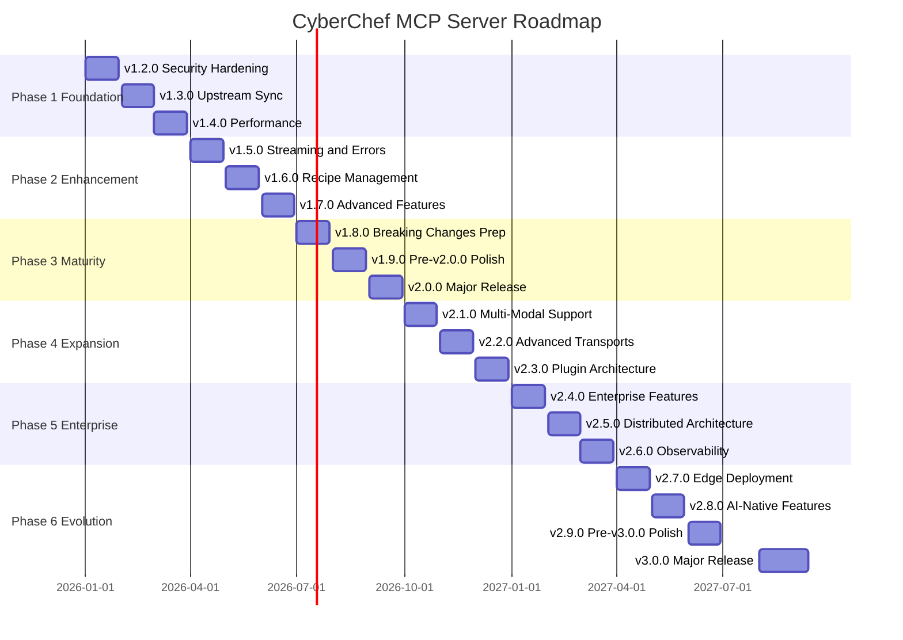

# CyberChef MCP Server - Product Roadmap

**Version:** 1.1.0 → 3.0.0
**Timeline:** January 2026 - August 2027
**Last Updated:** December 2025

## Vision

Transform CyberChef MCP Server from a functional prototype into a production-ready, enterprise-grade MCP server that serves as the definitive bridge between AI assistants and CyberChef's 300+ data manipulation operations.

## Strategic Themes

### Phase 1: Foundation (v1.2.0 - v1.4.0) - Q1 2026
**Focus:** Security, reliability, and operational excellence

Establish production-ready infrastructure with enterprise-grade security, automated upstream synchronization, and performance optimization. This phase addresses the critical gaps preventing production deployment.

### Phase 2: Enhancement (v1.5.0 - v1.7.0) - Q2 2026
**Focus:** Advanced MCP features and user experience

Extend MCP protocol capabilities with streaming support, recipe management, and batch processing. This phase transforms the server from a simple tool wrapper into a sophisticated data manipulation platform.

### Phase 3: Maturity (v1.8.0 - v2.0.0) - Q3 2026
**Focus:** Breaking changes, API stabilization, and long-term maintainability

Prepare for and execute a major version release with architectural improvements, enhanced type safety, and a refined API surface. This phase sets the foundation for sustained evolution.

### Phase 4: Expansion (v2.1.0 - v2.3.0) - Q4 2026
**Focus:** Multi-modal support, advanced transports, and plugin architecture

Extend the platform with binary/image handling, WebSocket/SSE transports, and a sandboxed plugin system. This phase transforms the server into a fully extensible platform supporting the complete MCP specification.

### Phase 5: Enterprise (v2.4.0 - v2.6.0) - Q1 2027
**Focus:** Authentication, scaling, and observability

Deploy enterprise-grade features including OAuth 2.1 authentication, RBAC authorization, horizontal scaling with Kubernetes, and comprehensive OpenTelemetry observability. This phase enables production deployment at scale.

### Phase 6: Evolution (v2.7.0 - v3.0.0) - Q2-Q3 2027
**Focus:** Edge deployment, AI-native features, and major version evolution

Prepare for and execute v3.0.0 with edge computing support, AI-assisted operations, and breaking API improvements. This phase establishes the next-generation architecture with a stable API contract through 2029.

## Release Timeline

## Release Overview

### Phase 1-3 (v1.2.0 - v2.0.0)

| Release | Theme | Key Features | Effort | Risk |
|---------|-------|--------------|--------|------|
| **v1.2.6** | Container Optimization | nginx:alpine-slim for web app, non-root permissions | S | Low |
| **v1.2.5** | Security Patch | GitHub alerts, OWASP Argon2 hardening, build fixes | S | Low |
| **v1.2.0** | Security Hardening | Docker DHI, non-root, security scanning | L | Medium |
| **v1.3.0** | Upstream Sync | Automated CyberChef updates, Renovate/Dependabot | XL | Medium |
| **v1.4.0** | Performance | Streaming optimization, worker threads, memory management | L | Low |
| **v1.5.0** | Streaming & Errors | Large operation support, enhanced error handling | L | Medium |
| **v1.6.0** | Recipe Management | Save/load/share recipes, recipe library | XL | Medium |
| **v1.7.0** | Advanced Features | Batch processing, telemetry, rate limiting | L | Low |
| **v1.8.0** | Breaking Changes Prep | Deprecation warnings, migration guides | M | High |
| **v1.9.0** | Pre-v2.0.0 Polish | Final testing, documentation, migration tools | M | Medium |
| **v2.0.0** | Major Release | Breaking changes, API stabilization, type system | XL | High |

### Phase 4-6 (v2.1.0 - v3.0.0)

| Release | Theme | Key Features | Effort | Risk |
|---------|-------|--------------|--------|------|
| **v2.1.0** | Multi-Modal Support | Binary data handling, image operations, MIME detection | L | Medium |
| **v2.2.0** | Advanced Transports | WebSocket, Streamable HTTP, SSE (deprecated) | L | Medium |
| **v2.3.0** | Plugin Architecture | Plugin system, sandboxed execution, plugin registry | XL | High |
| **v2.4.0** | Enterprise Features | OAuth 2.1, RBAC, audit logging, multi-tenancy | XL | High |
| **v2.5.0** | Distributed Architecture | Kubernetes scaling, service mesh, warm pools | XL | High |
| **v2.6.0** | Observability | OpenTelemetry traces/metrics/logs, dashboards, alerts | L | Medium |
| **v2.7.0** | Edge Deployment | WebAssembly/WASI, edge runtime, offline support | L | High |
| **v2.8.0** | AI-Native Features | NL-to-recipe, operation suggestions, smart recipes | M | Medium |
| **v2.9.0** | Pre-v3.0.0 Polish | Migration tooling, deprecation warnings, compatibility mode | M | Medium |
| **v3.0.0** | Major Release | API evolution, breaking changes, v2.x LTS | XL | High |

**Effort:** S (1-3 days), M (4-7 days), L (1-2 weeks), XL (2-4 weeks)

## Key Deliverables by Phase

### Phase 1: Foundation
- Container security hardening (95% vulnerability reduction target)
- Automated upstream dependency tracking
- Performance benchmarks and optimization
- Production-ready CI/CD pipeline
- Comprehensive security documentation

### Phase 2: Enhancement
- Streaming API for large operations (1GB+ support)
- Recipe management system
- Batch processing capabilities
- Progress reporting and telemetry
- Enhanced error context and recovery

### Phase 3: Maturity
- v2.0.0 breaking changes specification
- Migration tooling and documentation
- Stabilized API contracts
- Long-term maintenance strategy
- Backward compatibility plan

### Phase 4: Expansion
- Multi-modal input/output (binary, image, audio)
- MIME type detection and base64 handling
- WebSocket and Streamable HTTP transports
- Plugin system with sandboxed execution
- Plugin registry and discovery
- Third-party operation support

### Phase 5: Enterprise
- OAuth 2.1 authentication (MCP as Resource Server)
- Role-Based Access Control (RBAC)
- Comprehensive audit logging
- Multi-tenancy with namespace isolation
- Kubernetes horizontal pod autoscaling
- Service mesh integration (Istio/Linkerd)
- OpenTelemetry traces, metrics, and logs

### Phase 6: Evolution
- Edge/WASM deployment support
- Offline operation capabilities
- AI-assisted recipe generation
- Natural language to recipe translation
- v3.0.0 breaking changes and API evolution
- v2.x Long-Term Support (LTS) maintenance

## Breaking Changes (v2.0.0)

The following breaking changes are planned for v2.0.0:

1. **Tool Naming Convention**: Simplified naming (remove `cyberchef_` prefix in some contexts)
2. **Recipe Format**: Enhanced recipe schema with validation
3. **Type System**: Stricter input/output typing with Zod v4
4. **MCP SDK**: Upgrade to latest protocol version (possibly 2026-xx-xx spec)
5. **Error Format**: Structured error responses with error codes
6. **Configuration**: Environment-based configuration system

All breaking changes will be:
- Announced in v1.8.0 with deprecation warnings
- Documented in migration guides (v1.9.0)
- Supported by automated migration tools where feasible

## Breaking Changes (v3.0.0)

The following breaking changes are planned for v3.0.0:

1. **Simplified Tool Naming**: Remove mandatory `cyberchef_` prefix (configurable)
2. **Recipe Schema v2**: Named arguments instead of positional arrays
3. **Structured Errors**: Rich error format with codes, context, and suggestions
4. **Unified Configuration**: Single config file replaces environment variables
5. **Plugin API v2**: Updated plugin interface with lifecycle hooks
6. **MCP Protocol 2027**: Update to latest MCP specification

All v3.0.0 breaking changes will be:
- Announced in v2.8.0 with deprecation warnings
- Documented in comprehensive migration guides (v2.9.0)
- Supported by `npx cyberchef-migrate` CLI tool
- Available in compatibility mode for gradual migration

### v2.x Long-Term Support (LTS)

After v3.0.0 release:
- **Security fixes**: 12 months (until August 2028)
- **Critical bugs**: 6 months (until February 2028)
- **New features**: None
- **End of Life**: August 2028

## Success Metrics

### Technical Metrics
- **Security**: <10 CVEs in container image (target: 0)
- **Performance**: Handle 100MB operations without crashes
- **Reliability**: 99.9% uptime in production deployments
- **Coverage**: >80% test coverage for MCP server code
- **Sync**: Upstream updates within 24 hours of CyberChef release

### Adoption Metrics
- GitHub stars growth
- Docker image pull count
- Community contributions (PRs, issues)
- Documentation quality (low issue rate)

## Dependencies & Prerequisites

### External Dependencies
- **Upstream CyberChef**: Monitor for breaking changes
- **MCP Protocol**: Track specification updates
- **Node.js**: Stay current with LTS releases (22.x → 24.x)
- **Docker**: Container runtime compatibility

### Internal Prerequisites
- Comprehensive test suite (Phase 1)
- Security scanning in CI (Phase 1)
- Performance benchmarks (Phase 1)
- Documentation infrastructure (Phase 1)

## Risk Management

### High-Risk Areas
1. **Upstream Breaking Changes**: CyberChef API changes could break tool mappings
   - **Mitigation**: Automated testing on upstream updates, version pinning
2. **MCP Protocol Evolution**: Protocol changes may require server rewrites
   - **Mitigation**: Track MCP specification, participate in community discussions
3. **v2.0.0 Migration**: Users may struggle with breaking changes
   - **Mitigation**: Comprehensive migration guides, automated tools, gradual rollout

### Medium-Risk Areas
1. **Performance Regressions**: Optimization could introduce bugs
   - **Mitigation**: Benchmark suite, performance testing in CI
2. **Security Vulnerabilities**: New features could introduce attack vectors
   - **Mitigation**: Security review process, automated scanning, penetration testing

## Communication Plan

### Release Cadence
- Monthly releases (v1.2.0 - v1.7.0)
- Extended testing for v1.8.0, v1.9.0, v2.0.0
- Hotfix releases as needed (v1.x.y)

### Documentation Updates
- Release notes for each version (docs/releases/)
- Updated user guide and architecture docs
- Blog posts for major releases (v1.5.0, v2.0.0)
- Migration guides (v1.9.0, v2.0.0)

### Community Engagement
- GitHub Discussions for feature proposals
- Issue templates for bug reports and feature requests
- Security disclosure policy
- Contributor guidelines

## Long-Term Vision (Beyond v3.0.0)

### v3.1.0+: Platform Maturity (2028+)
- Multi-language SDK support (Python, Rust, Go bindings)
- GraphQL-style query interface for complex operations
- Federated plugin marketplace
- Cross-MCP server orchestration
- Real-time collaboration features

### v4.0.0: Next Generation (2029+)
- Distributed operation execution across clusters
- Advanced caching with global invalidation
- Machine learning-optimized operation selection
- Full WebAssembly runtime support
- Quantum-safe cryptographic operations

## References

### Phase Documentation
- [Phase 1: Foundation](./planning/phase-1-foundation.md) (v1.2.0-v1.4.0)
- [Phase 2: Enhancement](./planning/phase-2-enhancement.md) (v1.5.0-v1.7.0)
- [Phase 3: Maturity](./planning/phase-3-maturity.md) (v1.8.0-v2.0.0)
- [Phase 4: Expansion](./planning/phase-4-expansion.md) (v2.1.0-v2.3.0)
- [Phase 5: Enterprise](./planning/phase-5-enterprise.md) (v2.4.0-v2.6.0)
- [Phase 6: Evolution](./planning/phase-6-evolution.md) (v2.7.0-v3.0.0)

### Strategy Documents
- [Multi-Modal Strategy](./planning/MULTI-MODAL-STRATEGY.md)
- [Plugin Architecture Design](./planning/PLUGIN-ARCHITECTURE-DESIGN.md)
- [Enterprise Features Plan](./planning/ENTERPRISE-FEATURES-PLAN.md)
- [Upstream Sync Strategy](./planning/UPSTREAM-SYNC-STRATEGY.md)
- [Security Hardening Plan](./planning/SECURITY-HARDENING-PLAN.md)

### Release Plans
- [Individual Release Plans](./planning/) (v1.2.0 - v3.0.0)

---

**Research Sources:**
- [MCP Best Practices](https://modelcontextprotocol.info/docs/best-practices/)
- [Docker Security 2025](https://cloudnativenow.com/topics/cloudnativedevelopment/docker/docker-security-in-2025-best-practices-to-protect-your-containers-from-cyberthreats/)
- [Node.js 22 Streaming Optimization](https://markaicode.com/nodejs-22-streams-optimization-guide/)
- [Automated Dependency Updates](https://docs.renovatebot.com/modules/manager/github-actions/)
