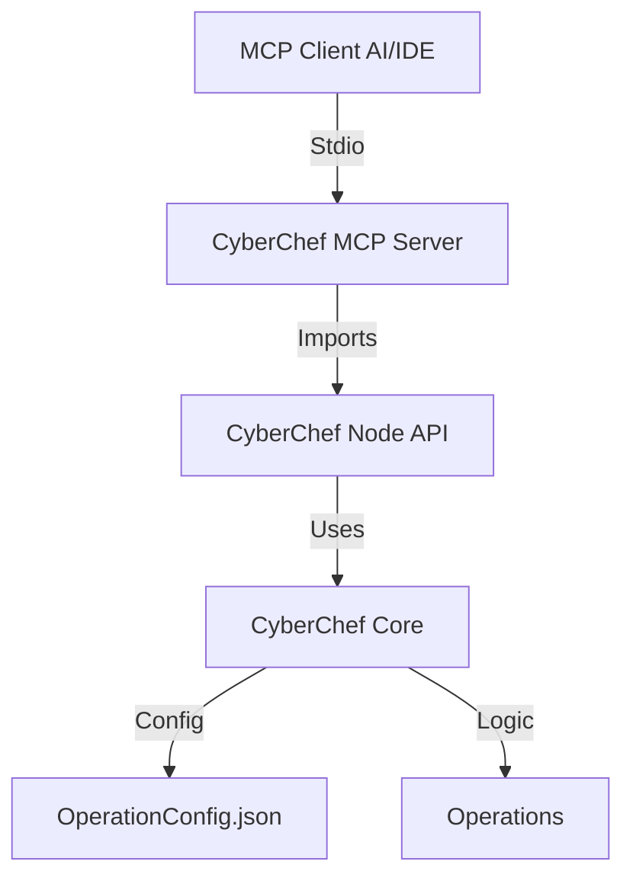

# CyberChef MCP Architecture

## High-Level Design

The solution involves creating a new entry point in the `src/node/` directory that functions as the MCP Server. This server interfaces with the existing CyberChef Core Node API (`src/node/index.mjs`) to execute operations.

## Components

### 1. MCP Server Entry Point (`src/node/mcp-server.mjs`)
-   **Role:** Handles the MCP protocol connection (stdio transport).
-   **Dependencies:** `@modelcontextprotocol/sdk`, `zod`.
-   **Responsibilities:**
    -   Initialize the MCP server instance.
    -   Load `OperationConfig` and `Categories` to discover available operations.
    -   Register the `listTools` handler.
    -   Register the `callTool` handler.
    -   Translate MCP tool calls into CyberChef `bake()` calls.

### 2. Tool Mapping Strategy

There are two layers of tools provided:

#### A. The "Bake" Meta-Tool (`cyberchef_bake`)
Direct access to the core `bake` function.
-   **Input:**
    -   `input`: The string/data to process.
    -   `recipe`: A JSON array describing the operations (e.g., `[{"op": "From Base64"}, {"op": "Gunzip"}]`).
-   **Output:** Result string and type information.

#### B. Dynamic Operation Tools (`cyberchef_<op_name>`)
Programmatically generated tools for every supported CyberChef operation.
-   **Name:** Normalized operation name (e.g., "AES Decrypt" -> `cyberchef_aes_decrypt`).
-   **Description:** Taken from `OperationConfig.description`.
-   **Arguments:** Mapped from `OperationConfig.args`.
    -   `type: "option"` -> Zod Enum.
    -   `type: "string"` -> Zod String.
    -   `type: "number"` -> Zod Number.
    -   `type: "boolean"` -> Zod Boolean.
-   **Execution:** Internally constructs a single-step recipe and calls `bake()`.

### 3. Containerization (`Dockerfile.mcp`)
A specialized Docker build for the server.
-   **Base:** `node:18-alpine`.
-   **Context:** Copies `src/`, `package.json`.
-   **Command:** `node src/node/mcp-server.mjs`.

## Data Flow
1.  **Discovery:** Client requests `listTools`. Server iterates `OperationConfig` and generates tool schemas.
2.  **Invocation:** Client calls `cyberchef_to_base64({ input: "hello" })`.
3.  **Translation:** Server maps this to a recipe: `[{ op: "To Base64", args: [] }]`.
4.  **Execution:** Server calls `CyberChef.bake("hello", recipe)`.
5.  **Response:** Server returns the output string to the Client.
