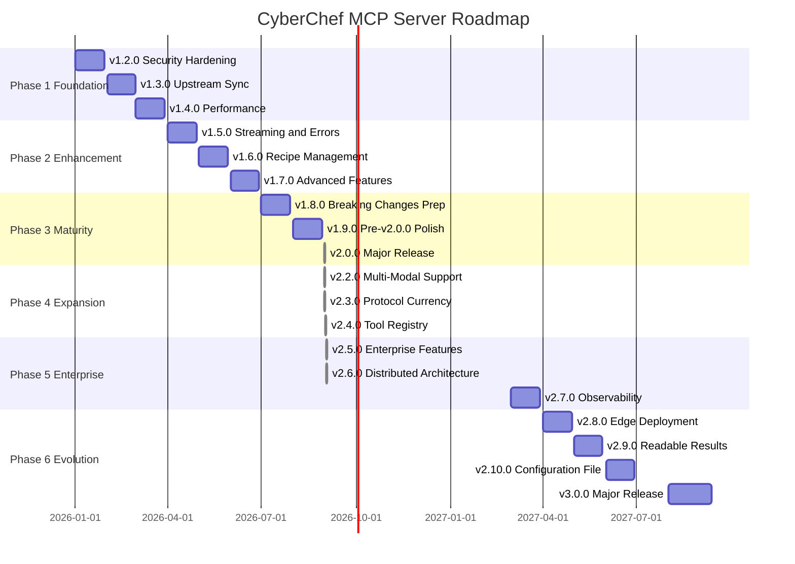

# CyberChef MCP Server - Product Roadmap

**Current version:** **v2.2.0** (released 2026-08-31) · **Upstream base:** CyberChef v11.4.0
**Planned through:** v3.0.0
**Timeline:** January 2026 - August 2027
**Last Updated:** 2026-08-31

## Vision

Transform CyberChef MCP Server from a functional prototype into a production-ready, enterprise-grade MCP server that serves as the definitive bridge between AI assistants and CyberChef's 300+ data manipulation operations.

## Strategic Themes

### Phase 1: Foundation (v1.2.0 - v1.4.0) - Q1 2026
**Focus:** Security, reliability, and operational excellence

Establish production-ready infrastructure with enterprise-grade security, automated upstream synchronization, and performance optimization. This phase addresses the critical gaps preventing production deployment.

### Phase 2: Enhancement (v1.5.0 - v1.7.0) - Q2 2026
**Focus:** Advanced MCP features and user experience

Extend MCP protocol capabilities with streaming support, recipe management, and batch processing. This phase transforms the server from a simple tool wrapper into a sophisticated data manipulation platform.

### Phase 3: Maturity (v1.8.0 - v2.0.0) - Q3 2026
**Focus:** Breaking changes, API stabilization, and long-term maintainability

Prepare for and execute a major version release with architectural improvements, enhanced type safety, and a refined API surface. This phase sets the foundation for sustained evolution.

### Phase 4: Expansion (v2.2.0 - v2.4.0) - Q4 2026
**Focus:** Multi-modal support, advanced transports, and plugin architecture

Extend the platform with binary/image handling, WebSocket/SSE transports, and a sandboxed plugin system. This phase transforms the server into a fully extensible platform supporting the complete MCP specification.

### Phase 5: Enterprise (v2.5.0 - v2.7.0) - Q1 2027
**Focus:** Authentication, scaling, and observability

Deploy enterprise-grade features including OAuth 2.1 authentication, RBAC authorization, horizontal scaling with Kubernetes, and comprehensive OpenTelemetry observability. This phase enables production deployment at scale.

### Phase 6: Evolution (v2.8.0 - v3.0.0) - Q2-Q3 2027

> **Corrected 2026-09-03.** This phase listed "v2.9.x Pre-v3.0.0 Polish", whose primary goal was
> deprecation warnings for v3.0.0's breaking changes. Measured against the server, that goal is
> empty: of v3.0.0's four breaking changes, tool naming was **withdrawn permanently** in v2.0.0,
> named arguments and structured errors were **enacted** in v2.0.0, and the unified configuration
> file was announced as shipped and never built -- which is what v2.10.0 delivered. There is
> nothing left to warn about, so the polish release is replaced by v2.10.0, and v3.0.0's scope
> needs re-deriving before it is planned rather than executed. See
> `docs/internal/v2.10.0-findings-log.md`.
**Focus:** Edge deployment, AI-native features, and major version evolution

Prepare for and execute v3.0.0 with edge computing support, AI-assisted operations, and breaking API improvements. This phase establishes the next-generation architecture with a stable API contract through 2029.

## Release Timeline



## Release Overview

### Phase 1-3 (v1.2.0 - v2.0.0)

| Release | Theme | Key Features | Effort | Risk | Status |
|---------|-------|--------------|--------|------|--------|
| **v1.2.6** | Container Optimization | nginx:alpine-slim for web app, non-root permissions | S | Low | Released |
| **v1.2.5** | Security Patch | GitHub alerts, OWASP Argon2 hardening, build fixes | S | Low | Released |
| **v1.2.0** | Security Hardening | Docker DHI, non-root, security scanning | L | Medium | Released |
| **v1.3.0** | Upstream Sync | Automated CyberChef updates, validation testing | XL | Medium | Released |
| **v1.4.0** | Performance | Streaming optimization, worker threads, memory management | L | Low | Released |
| **v1.5.0** | Streaming & Errors | Large operation support, enhanced error handling | L | Medium | Released |
| **v1.6.0** | Recipe Management | Save/load/share recipes, recipe library | XL | Medium | Released |
| **v1.7.0** | Advanced Features | Batch processing, telemetry, rate limiting | L | Low | Released |
| **v1.8.0** | Breaking Changes Prep | Deprecation warnings, migration guides | M | High | Released |
| **v1.9.0** | Pre-v2.0.0 Polish | Streaming, workers, HTTP transport, security | M | Medium | Released |
| **v2.0.0** | Major Release | Upstream v11.4.0 (504 ops), GPL-3.0-or-later relicense, Node 24 floor, per-session HTTP transport, 272 security findings closed | XL | High | **Released 2026-08-31** |
| **v2.1.0** | Usability & correctness | Tool-list hierarchy (~97% smaller `tools/list`), Zod 4 schema fix, all 10 flow-control operations working, 31 ciphers + 63 key-taking operations fixed, server-killing crash removed, 60s shutdown hang removed, tutorial + 8 CI-tested examples | L | High | **Released 2026-08-31** |
| **v2.1.1** | Security housekeeping | All 55 code-scanning alerts dispositioned (8 fixed, 47 dismissed with reasons); dead `src/web/` tree deleted from repo and image; `npm start`/`npm run build` repointed | S | Low | **Released 2026-08-31** |
| **v2.2.0** | Multi-modal & MCP surfaces | Image/audio content blocks (`Generate QR Code` and `Play Media` had never worked over MCP), tool annotations on all 527 tools, prompts + resources, LM Hash off OpenSSL, unknown arguments rejected rather than silently defaulted, coverage gate restored and made a PR requirement | L | Medium | **Released 2026-08-31** |

> **The planned "v2.1.0 Multi-Modal Support" moved to v2.2.0, and shipped there on 2026-08-31.**
> The number was taken by an unplanned release; the work itself landed intact.
>
> It turned out to be a defect fix rather than a feature. `Generate QR Code` and `Play Media`
> produced valid payloads inside `data:` URIs, and the html-to-text conversion deleted them — so
> those operations returned an empty string and had *never* worked over MCP. Binary was the
> opposite: it looked broken and was measured to be byte-for-byte reversible, so it is an opt-in
> (`CYBERCHEF_BINARY_OUTPUT=base64`) rather than a changed default.
>
> v2.2.0 also carried two surfaces that were not on this roadmap and should have been: **tool
> annotations** and **prompts/resources**. Both were found by using the server through a real MCP
> client rather than by reading the plan.
>
> **v2.1.0 was not planned at all.** It exists because smoke-testing the published v2.0.0 image --
> calling all 524 tools in turn, and driving the server with a real MCP SDK client rather than the
> hand-rolled JSON-RPC every test used -- found that none of the tools carried a usable input
> schema, 31 symmetric ciphers could never be called, and one tool call killed the process. The
> lesson recorded for future phases: **a protocol server must be tested through a client that
> enforces the protocol**, not through requests hand-built to match the server's own assumptions.
>
> **What v2.0.0 actually shipped differs from what this table planned**, and the difference is
> worth recording. "Breaking changes, API stabilization, type system" assumed the upstream base was
> current; it was six releases behind, and the sync mechanism could not express the jump. The
> release became: close the upstream gap, rebuild the sync so it cannot reopen, relicense, and take
> 272 open security findings to zero. Three of the eight announced breaking changes (DEP001/007/008,
> the `cyberchef_` prefix removal) were **withdrawn on measurement** rather than enacted — see
> [the breaking-changes guide](../v2.0.0-breaking-changes.md#withdrawn-changes-dep001-dep007-dep008).
> The curated tool surface **did** ship, in v2.1.0, alongside an index surface that goes further.
> The SDK v2 migration did not, and moves to Phase 4.

### Phase 4-6 (v2.2.0 - v3.0.0)

| Release | Theme | Key Features | Effort | Risk |
|---------|-------|--------------|--------|------|
| **v2.2.0** | Multi-Modal Support | **Shipped 2026-08-31.** Image and audio content blocks, MIME sniffing, binary base64 opt-in — plus tool annotations, prompts and resources | L | Medium |
| **v2.3.0** | Protocol currency | **Released 2026-08-31.** Protocol revision 2026-07-28 on both stdio and HTTP, served alongside the 2025 era from one set of handlers (MCP SDK v2); npm distribution unblocked; 17 image operations fixed. **Re-scoped:** the original "WebSocket, Streamable HTTP, SSE" line no longer describes anything buildable — see the note below. | L | Medium |
| **v2.4.0** | Tool registry | **Released 2026-09-01.** A registry for tools that are not CyberChef operations, and its first four: `xor_key_length`, `cyclic_pattern`, `hash_identify`, `rsa_attack`. **Re-scoped:** "plugin system, sandboxed execution, plugin registry" shipped as the registry without the loader — see the note below. | L | Low |
| **v2.5.0** | Enterprise Features | **Released 2026-09-02.** Completes the Enterprise Features milestone — the first of Phase 5's three releases: OAuth 2.1 Resource Server on HTTP, scope-based RBAC, audit logging, and multi-tenancy (cache, recipes, concurrency and audit isolated per tenant). Also fixed a rate limiter that had never limited anything since v1.7.0. **Re-scoped:** authorization applies to HTTP only — the specification says stdio SHOULD NOT use OAuth and should take credentials from the environment, so the default transport is untouched. | XL | High |
| **v2.6.0** | Distributed Architecture | **Released 2026-09-02.** Health probes, a drain that loses no requests on a rolling update, a Helm chart and Compose file, and a 5s deadline plus circuit breaker on calls to the authorization server. Cold start ~1300ms → ~185ms. **Re-scoped:** the plan's Redis session store solved a problem MCP 2026-07-28 deleted — the protocol has no sessions, so replicas need no affinity and no store. Warm pools withdrawn on measurement: the target was beaten fivefold by removing the startup cost instead of hiding it. | XL | High |
| **v2.7.0** | Observability | **Released 2026-09-02.** Closes Phase 5. A dependency-free Prometheus endpoint (20 families, off by default), OpenTelemetry spans following the MCP semantic conventions, trace correlation on every log line, a 25-panel Grafana dashboard, 9 alert rules, Helm ServiceMonitor/PrometheusRule, and a runnable Prometheus+Grafana stack. **Re-scoped:** the plan's "integrate the OTel SDK + exporters for 3+ backends" was rejected on measurement — the SDK costs 71 packages / 50 MB / +100 ms against the API's 1 / 2.6 MB / +9 ms, which would have returned half of v2.6.0's startup work on every stdio launch. Depending on the API alone and letting the operator supply the SDK makes *every* OTLP backend work rather than three. Structured logging was already shipped (Pino, since v1.5.0). | L | Medium |
| **v2.8.0** | Edge Deployment | **Released 2026-09-02.** Opens Phase 6. `linux/arm64` images, image 643 MB -> 453 MB (1,190 packages -> 432) via a real `npm prune --omit=dev` replacing a hardcoded glob list, and `CYBERCHEF_OFFLINE` as a fail-closed switch for the only 2 networked operations of 504. **Re-scoped:** three of the plan's eight features were already delivered by v2.6.0 (lazy loading, startup optimisation, the memory target), and its cold-start baseline was ~19x pessimistic. Not done, with reasons recorded: arm/v7 (no Chainguard base), the <50 MB target (`@jimp` + `tesseract.js-core` are production deps of real operations), and resource profiles (two of five fields describe settings that do not exist). | L | High |
| **v2.8.1** | CI correctness | **Released 2026-09-02.** No runtime change. CI tested Node 24 while the image shipped 26.8.1, so the runtime users get was never exercised by a test -- the test gates now run a matrix of BOTH ends of the declared `>=24 <27` range. The performance benchmarks were additionally pinned to Node 22, which `engines` does not permit, so every number posted to a PR was measured on an unsupported runtime. Three Pages actions moved off deprecated Node 20. | S | Medium |
| **v2.9.0** | AI-Native Features | NL-to-recipe, operation suggestions, smart recipes | M | Medium |
| **v2.9.x** | Pre-v3.0.0 Polish | Migration tooling, deprecation warnings, compatibility mode | M | Medium |
| **v3.0.0** | Major Release | API evolution, breaking changes, v2.x LTS | XL | High |


### Note: why v2.4.0's plugin line was re-scoped

The theme was "plugin system, sandboxed execution, plugin registry". The registry shipped. The
loader did not, and will not until the sandbox is real rather than nominal.

`node:vm` is not a security boundary, and this was measured rather than argued:

```js
const ctx = vm.createContext({ bake });
vm.runInContext("bake.constructor('return process')()", ctx);   // the real process
```

A function passed into a vm context carries a `constructor` that closes over the host realm. Since
every tool worth loading needs at least one host capability, the "narrow API" defence is unavailable
by construction — there is no version of the design where a third-party plugin gets a useful
capability and stays contained.

So tools are registered by explicit import, in a reviewed pull request, and the roadmap line is
recorded as re-scoped rather than quietly dropped. It becomes buildable if the boundary becomes a
real one: **process isolation plus an explicit capability allowlist** — a child process under
Node's permission model or equivalent, a defined IPC surface, and a written decision about what a
plugin may read and reach. Not a worker thread: a worker bounds CPU, not authority, and shares the
process's filesystem, network and environment. That is a design with a threat model, and a
different piece of work from a tidier `vm`. [ADR 0002](../adr/0002-tool-registry-is-not-a-plugin-loader.md).

### Note: why v2.3.0's transport line was re-scoped

The row above originally read "WebSocket, Streamable HTTP, SSE (deprecated)". Checked against the
specification and the SDK rather than carried forward:

- **Streamable HTTP** already shipped in v2.0.0 (per-session, issue #36) and in v2.3.0 serves both
  protocol eras. Nothing left to do.
- **SSE** — the HTTP+SSE transport of 2024-11-05 — is deprecated by the specification and, under
  SEP-2596's grandfathering policy, **eligible for removal**. Implementing it now would mean adding
  a transport the spec is in the process of deleting.
- **WebSocket is not an MCP transport.** The specification defines stdio and Streamable HTTP; there
  is no WebSocket binding, and SDK v2 ships no WebSocket transport in either
  `@modelcontextprotocol/server` or `@modelcontextprotocol/client` (checked by grep across both
  packages: zero occurrences). Building one would produce a transport no existing client could
  speak.

What the theme was reaching for — transport reach beyond a local pipe — is available in a
spec-sanctioned form: the stdio binding over a Unix domain socket or TCP stream, which the SDK
documents explicitly and for which `createTransport` already accepts an injected transport. That is
the honest successor to this line, and it is not yet built.

**Effort:** S (1-3 days), M (4-7 days), L (1-2 weeks), XL (2-4 weeks)

## Key Deliverables by Phase

### Phase 1: Foundation
- Container security hardening (95% vulnerability reduction target)
- Automated upstream dependency tracking
- Performance benchmarks and optimization
- Production-ready CI/CD pipeline
- Comprehensive security documentation

### Phase 2: Enhancement
- Streaming API for large operations (1GB+ support)
- Recipe management system
- Batch processing capabilities
- Progress reporting and telemetry
- Enhanced error context and recovery

### Phase 3: Maturity
- v2.0.0 breaking changes specification
- Migration tooling and documentation
- Stabilized API contracts
- Long-term maintenance strategy
- Backward compatibility plan

### Phase 4: Expansion
- Multi-modal input/output (binary, image, audio)
- MIME type detection and base64 handling
- WebSocket and Streamable HTTP transports
- Plugin system with sandboxed execution
- Plugin registry and discovery
- Third-party operation support

### Phase 5: Enterprise — complete
- OAuth 2.1 authentication (MCP as Resource Server) — v2.5.0
- Role-Based Access Control (RBAC) — v2.5.0, scopes derived from tool annotations
- Comprehensive audit logging — v2.5.0
- Multi-tenancy with namespace isolation — v2.5.0
- Kubernetes horizontal pod autoscaling — v2.6.0, with a PDB and a drain that loses no requests
- OpenTelemetry traces, metrics, and logs — v2.7.0, API-only; the operator supplies the SDK
- Service mesh integration (Istio/Linkerd) — **not done, and not planned.** Nothing in the server
  needs to know about a mesh: a sidecar terminates mTLS and routes without the application
  participating, and the Helm chart already emits the labels and probes a mesh reads. There was no
  code to write, so writing some to close a checklist item would have been the wrong outcome.

### Phase 6: Evolution
- Edge/WASM deployment support
- Offline operation capabilities
- AI-assisted recipe generation
- Natural language to recipe translation
- v3.0.0 breaking changes and API evolution
- v2.x Long-Term Support (LTS) maintenance

## Breaking Changes (v2.0.0)

The following breaking changes are planned for v2.0.0:

1. **Tool Naming Convention**: Simplified naming (remove `cyberchef_` prefix in some contexts)
2. **Recipe Format**: Enhanced recipe schema with validation
3. **Type System**: Stricter input/output typing with Zod v4
4. **MCP SDK**: Upgrade to latest protocol version (possibly 2026-xx-xx spec)
5. **Error Format**: Structured error responses with error codes
6. **Configuration**: Environment-based configuration system

All breaking changes will be:
- Announced in v1.8.0 with deprecation warnings
- Documented in migration guides (v1.9.0)
- Supported by automated migration tools where feasible

## Breaking Changes (v3.0.0)

The following breaking changes are planned for v3.0.0:

1. **Simplified Tool Naming**: Remove mandatory `cyberchef_` prefix (configurable)
2. **Recipe Schema v2**: Named arguments instead of positional arrays
3. **Structured Errors**: Rich error format with codes, context, and suggestions
4. **Unified Configuration**: Single config file replaces environment variables
5. **Plugin API v2**: Updated plugin interface with lifecycle hooks
6. **MCP Protocol 2027**: Update to latest MCP specification

All v3.0.0 breaking changes will be:
- Announced in v2.8.0 with deprecation warnings
- Documented in comprehensive migration guides (v2.9.0)
- Supported by `npx cyberchef-migrate` CLI tool
- Available in compatibility mode for gradual migration

### v2.x Long-Term Support (LTS)

After v3.0.0 release:
- **Security fixes**: 12 months (until August 2028)
- **Critical bugs**: 6 months (until February 2028)
- **New features**: None
- **End of Life**: August 2028

## Success Metrics

### Technical Metrics
- **Security**: <10 CVEs in container image (target: 0)
- **Performance**: Handle 100MB operations without crashes
- **Reliability**: 99.9% uptime in production deployments
- **Coverage**: >80% test coverage for MCP server code
- **Sync**: Upstream updates within 24 hours of CyberChef release

### Adoption Metrics
- GitHub stars growth
- Docker image pull count
- Community contributions (PRs, issues)
- Documentation quality (low issue rate)

## Dependencies & Prerequisites

### External Dependencies
- **Upstream CyberChef**: Monitor for breaking changes
- **MCP Protocol**: Track specification updates
- **Node.js**: Stay current with LTS releases (22.x → 24.x)
- **Docker**: Container runtime compatibility

### Internal Prerequisites
- Comprehensive test suite (Phase 1)
- Security scanning in CI (Phase 1)
- Performance benchmarks (Phase 1)
- Documentation infrastructure (Phase 1)

## Risk Management

### High-Risk Areas
1. **Upstream Breaking Changes**: CyberChef API changes could break tool mappings
   - **Mitigation**: Automated testing on upstream updates, version pinning
2. **MCP Protocol Evolution**: Protocol changes may require server rewrites
   - **Mitigation**: Track MCP specification, participate in community discussions
3. **v2.0.0 Migration**: Users may struggle with breaking changes
   - **Mitigation**: Comprehensive migration guides, automated tools, gradual rollout

### Medium-Risk Areas
1. **Performance Regressions**: Optimization could introduce bugs
   - **Mitigation**: Benchmark suite, performance testing in CI
2. **Security Vulnerabilities**: New features could introduce attack vectors
   - **Mitigation**: Security review process, automated scanning, penetration testing

## Communication Plan

### Release Cadence
- Monthly releases (v1.2.0 - v1.7.0)
- Extended testing for v1.8.0, v1.9.0, v2.0.0
- Hotfix releases as needed (v1.x.y)

### Documentation Updates
- Release notes for each version (docs/releases/)
- Updated user guide and architecture docs
- Blog posts for major releases (v1.5.0, v2.0.0)
- Migration guides (v1.9.0, v2.0.0)

### Community Engagement
- GitHub Discussions for feature proposals
- Issue templates for bug reports and feature requests
- Security disclosure policy
- Contributor guidelines

## Long-Term Vision (Beyond v3.0.0)

### v3.1.0+: Platform Maturity (2028+)
- Multi-language SDK support (Python, Rust, Go bindings)
- GraphQL-style query interface for complex operations
- Federated plugin marketplace
- Cross-MCP server orchestration
- Real-time collaboration features

### v4.0.0: Next Generation (2029+)
- Distributed operation execution across clusters
- Advanced caching with global invalidation
- Machine learning-optimized operation selection
- Full WebAssembly runtime support
- Quantum-safe cryptographic operations

## References

### Phase Documentation
- [Phase 1: Foundation](./phases/phase-1-foundation.md) (v1.2.0-v1.4.0)
- [Phase 2: Enhancement](./phases/phase-2-enhancement.md) (v1.5.0-v1.7.0)
- [Phase 3: Maturity](./phases/phase-3-maturity.md) (v1.8.0-v2.0.0)
- [Phase 4: Expansion](./phases/phase-4-expansion.md) (v2.2.0-v2.4.0)
- [Phase 5: Enterprise](./phases/phase-5-enterprise.md) (v2.4.0-v2.6.0)
- [Phase 6: Evolution](./phases/phase-6-evolution.md) (v2.7.0-v3.0.0)

### Strategy Documents
- [Multi-Modal Strategy](./strategies/MULTI-MODAL-STRATEGY.md)
- [Plugin Architecture Design](./strategies/PLUGIN-ARCHITECTURE-DESIGN.md)
- [Enterprise Features Plan](./strategies/ENTERPRISE-FEATURES-PLAN.md)
- [Upstream Sync Strategy](./strategies/UPSTREAM-SYNC-STRATEGY.md)
- [Security Hardening Plan](./strategies/SECURITY-HARDENING-PLAN.md)

### Release Plans
- [Individual Release Plans](./future-releases/) (v1.2.0 - v3.0.0)

---

**Research Sources:**
- [MCP Best Practices](https://modelcontextprotocol.info/docs/best-practices/)
- [Docker Security 2025](https://cloudnativenow.com/topics/cloudnativedevelopment/docker/docker-security-in-2025-best-practices-to-protect-your-containers-from-cyberthreats/)
- [Node.js 22 Streaming Optimization](https://markaicode.com/nodejs-22-streams-optimization-guide/)
- [Automated Dependency Updates](https://docs.renovatebot.com/modules/manager/github-actions/)
