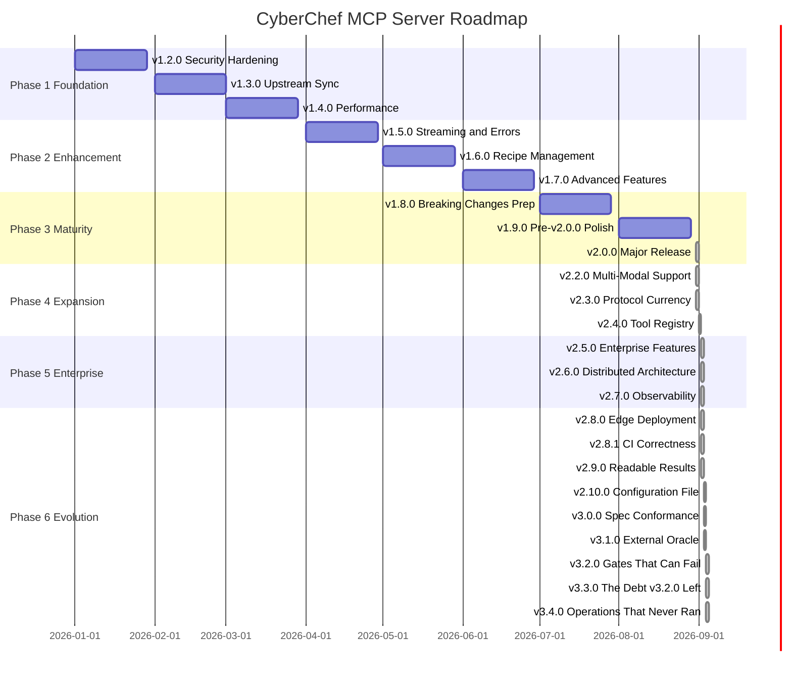

# CyberChef MCP Server - Product Roadmap

**Current version:** **v3.4.0** (released 2026-09-04) · **Upstream base:** CyberChef v11.4.0
**Charted through:** v4.0.0 — as one plan plus five charters, not five plans
**Timeline:** January 2026 - present
**Last Updated:** 2026-09-04

> **Read this before trusting a date below.** Every release from v2.5.0 onward opened by measuring
> its plan against the running server, and all six found the plan empty, already built, or
> superseded. The dates in this file's gantt were written in December 2025 and describe a schedule
> that reality outran by roughly eighteen months. They are corrected here as of 2026-09-03; the
> mechanism that keeps them from rotting again is
> [`v3/RE-MEASURE.md`](./v3/RE-MEASURE.md), which is mandatory before any charter becomes a
> release.

## Vision

Transform CyberChef MCP Server from a functional prototype into a production-ready, enterprise-grade MCP server that serves as the definitive bridge between AI assistants and CyberChef's 300+ data manipulation operations.

## Strategic Themes

### Phase 1: Foundation (v1.2.0 - v1.4.0) - shipped Q1 2026
**Focus:** Security, reliability, and operational excellence

Establish production-ready infrastructure with enterprise-grade security, automated upstream synchronization, and performance optimization. This phase addresses the critical gaps preventing production deployment.

### Phase 2: Enhancement (v1.5.0 - v1.7.0) - shipped Q2 2026
**Focus:** Advanced MCP features and user experience

Extend MCP protocol capabilities with streaming support, recipe management, and batch processing. This phase transforms the server from a simple tool wrapper into a sophisticated data manipulation platform.

### Phase 3: Maturity (v1.8.0 - v2.0.0) - shipped Q3 2026
**Focus:** Breaking changes, API stabilization, and long-term maintainability

Prepare for and execute a major version release with architectural improvements, enhanced type safety, and a refined API surface. This phase sets the foundation for sustained evolution.

### Phase 4: Expansion (v2.2.0 - v2.4.0) - shipped August-September 2026
**Focus:** Multi-modal support, advanced transports, and plugin architecture

Extend the platform with binary/image handling, WebSocket/SSE transports, and a sandboxed plugin system. This phase transforms the server into a fully extensible platform supporting the complete MCP specification.

### Phase 5: Enterprise (v2.5.0 - v2.7.0) - shipped September 2026
**Focus:** Authentication, scaling, and observability

Deploy enterprise-grade features including OAuth 2.1 authentication, RBAC authorization, horizontal scaling with Kubernetes, and comprehensive OpenTelemetry observability. This phase enables production deployment at scale.

### Phase 6: Evolution (v2.8.0 - v3.4.0) - shipped September 2026

> **Corrected 2026-09-03.** This phase listed "v2.9.x Pre-v3.0.0 Polish", whose primary goal was
> deprecation warnings for v3.0.0's breaking changes. Measured against the server, that goal is
> empty: of v3.0.0's four breaking changes, tool naming was **withdrawn permanently** in v2.0.0,
> named arguments and structured errors were **enacted** in v2.0.0, and the unified configuration
> file was announced as shipped and never built -- which is what v2.10.0 delivered. There is
> nothing left to warn about, so the polish release is replaced by v2.10.0, and v3.0.0's scope
> needs re-deriving before it is planned rather than executed. See
> `docs/internal/v2.10.0-findings-log.md`.
**Focus:** Edge deployment, result legibility, configuration, and specification conformance

What this phase actually delivered: arm64 images and a fail-closed offline mode (v2.8.0), a CI
matrix that exercises the runtime users get (v2.8.1), `Magic` made legible and executable to its
only consumer (v2.9.0), the unified configuration file promised nine releases earlier (v2.10.0),
and MCP 2026-07-28 conformance with the breaking cleanups it forces (v3.0.0). "AI-native features"
was measured and found already built; see the v2.9.0 findings log.

## Release Timeline



## Release Overview

### Phase 1-3 (v1.2.0 - v2.0.0)

| Release | Theme | Key Features | Effort | Risk | Status |
|---------|-------|--------------|--------|------|--------|
| **v1.2.6** | Container Optimization | nginx:alpine-slim for web app, non-root permissions | S | Low | Released |
| **v1.2.5** | Security Patch | GitHub alerts, OWASP Argon2 hardening, build fixes | S | Low | Released |
| **v1.2.0** | Security Hardening | Docker DHI, non-root, security scanning | L | Medium | Released |
| **v1.3.0** | Upstream Sync | Automated CyberChef updates, validation testing | XL | Medium | Released |
| **v1.4.0** | Performance | Streaming optimization, worker threads, memory management | L | Low | Released |
| **v1.5.0** | Streaming & Errors | Large operation support, enhanced error handling | L | Medium | Released |
| **v1.6.0** | Recipe Management | Save/load/share recipes, recipe library | XL | Medium | Released |
| **v1.7.0** | Advanced Features | Batch processing, telemetry, rate limiting | L | Low | Released |
| **v1.8.0** | Breaking Changes Prep | Deprecation warnings, migration guides | M | High | Released |
| **v1.9.0** | Pre-v2.0.0 Polish | Streaming, workers, HTTP transport, security | M | Medium | Released |
| **v2.0.0** | Major Release | Upstream v11.4.0 (504 ops), GPL-3.0-or-later relicense, Node 24 floor, per-session HTTP transport, 272 security findings closed | XL | High | **Released 2026-08-31** |
| **v2.1.0** | Usability & correctness | Tool-list hierarchy (~97% smaller `tools/list`), Zod 4 schema fix, all 10 flow-control operations working, 31 ciphers + 63 key-taking operations fixed, server-killing crash removed, 60s shutdown hang removed, tutorial + 8 CI-tested examples | L | High | **Released 2026-08-31** |
| **v2.1.1** | Security housekeeping | All 55 code-scanning alerts dispositioned (8 fixed, 47 dismissed with reasons); dead `src/web/` tree deleted from repo and image; `npm start`/`npm run build` repointed | S | Low | **Released 2026-08-31** |
| **v2.2.0** | Multi-modal & MCP surfaces | Image/audio content blocks (`Generate QR Code` and `Play Media` had never worked over MCP), tool annotations on all 527 tools, prompts + resources, LM Hash off OpenSSL, unknown arguments rejected rather than silently defaulted, coverage gate restored and made a PR requirement | L | Medium | **Released 2026-08-31** |

> **The planned "v2.1.0 Multi-Modal Support" moved to v2.2.0, and shipped there on 2026-08-31.**
> The number was taken by an unplanned release; the work itself landed intact.
>
> It turned out to be a defect fix rather than a feature. `Generate QR Code` and `Play Media`
> produced valid payloads inside `data:` URIs, and the html-to-text conversion deleted them — so
> those operations returned an empty string and had *never* worked over MCP. Binary was the
> opposite: it looked broken and was measured to be byte-for-byte reversible, so it is an opt-in
> (`CYBERCHEF_BINARY_OUTPUT=base64`) rather than a changed default.
>
> v2.2.0 also carried two surfaces that were not on this roadmap and should have been: **tool
> annotations** and **prompts/resources**. Both were found by using the server through a real MCP
> client rather than by reading the plan.
>
> **v2.1.0 was not planned at all.** It exists because smoke-testing the published v2.0.0 image --
> calling all 524 tools in turn, and driving the server with a real MCP SDK client rather than the
> hand-rolled JSON-RPC every test used -- found that none of the tools carried a usable input
> schema, 31 symmetric ciphers could never be called, and one tool call killed the process. The
> lesson recorded for future phases: **a protocol server must be tested through a client that
> enforces the protocol**, not through requests hand-built to match the server's own assumptions.
>
> **What v2.0.0 actually shipped differs from what this table planned**, and the difference is
> worth recording. "Breaking changes, API stabilization, type system" assumed the upstream base was
> current; it was six releases behind, and the sync mechanism could not express the jump. The
> release became: close the upstream gap, rebuild the sync so it cannot reopen, relicense, and take
> 272 open security findings to zero. Three of the eight announced breaking changes (DEP001/007/008,
> the `cyberchef_` prefix removal) were **withdrawn on measurement** rather than enacted — see
> [the breaking-changes guide](../v2.0.0-breaking-changes.md#withdrawn-changes-dep001-dep007-dep008).
> The curated tool surface **did** ship, in v2.1.0, alongside an index surface that goes further.
> The SDK v2 migration did not, and moves to Phase 4.

### Phase 4-6 (v2.2.0 - v3.4.0)

| Release | Theme | Key Features | Effort | Risk |
|---------|-------|--------------|--------|------|
| **v2.2.0** | Multi-Modal Support | **Shipped 2026-08-31.** Image and audio content blocks, MIME sniffing, binary base64 opt-in — plus tool annotations, prompts and resources | L | Medium |
| **v2.3.0** | Protocol currency | **Released 2026-08-31.** Protocol revision 2026-07-28 on both stdio and HTTP, served alongside the 2025 era from one set of handlers (MCP SDK v2); npm distribution unblocked; 17 image operations fixed. **Re-scoped:** the original "WebSocket, Streamable HTTP, SSE" line no longer describes anything buildable — see the note below. | L | Medium |
| **v2.4.0** | Tool registry | **Released 2026-09-01.** A registry for tools that are not CyberChef operations, and its first four: `xor_key_length`, `cyclic_pattern`, `hash_identify`, `rsa_attack`. **Re-scoped:** "plugin system, sandboxed execution, plugin registry" shipped as the registry without the loader — see the note below. | L | Low |
| **v2.5.0** | Enterprise Features | **Released 2026-09-02.** Completes the Enterprise Features milestone — the first of Phase 5's three releases: OAuth 2.1 Resource Server on HTTP, scope-based RBAC, audit logging, and multi-tenancy (cache, recipes, concurrency and audit isolated per tenant). Also fixed a rate limiter that had never limited anything since v1.7.0. **Re-scoped:** authorization applies to HTTP only — the specification says stdio SHOULD NOT use OAuth and should take credentials from the environment, so the default transport is untouched. | XL | High |
| **v2.6.0** | Distributed Architecture | **Released 2026-09-02.** Health probes, a drain that loses no requests on a rolling update, a Helm chart and Compose file, and a 5s deadline plus circuit breaker on calls to the authorization server. Cold start ~1300ms → ~185ms. **Re-scoped:** the plan's Redis session store solved a problem MCP 2026-07-28 deleted — the protocol has no sessions, so replicas need no affinity and no store. Warm pools withdrawn on measurement: the target was beaten fivefold by removing the startup cost instead of hiding it. | XL | High |
| **v2.7.0** | Observability | **Released 2026-09-02.** Closes Phase 5. A dependency-free Prometheus endpoint (20 families, off by default), OpenTelemetry spans following the MCP semantic conventions, trace correlation on every log line, a 25-panel Grafana dashboard, 9 alert rules, Helm ServiceMonitor/PrometheusRule, and a runnable Prometheus+Grafana stack. **Re-scoped:** the plan's "integrate the OTel SDK + exporters for 3+ backends" was rejected on measurement — the SDK costs 71 packages / 50 MB / +100 ms against the API's 1 / 2.6 MB / +9 ms, which would have returned half of v2.6.0's startup work on every stdio launch. Depending on the API alone and letting the operator supply the SDK makes *every* OTLP backend work rather than three. Structured logging was already shipped (Pino, since v1.5.0). | L | Medium |
| **v2.8.0** | Edge Deployment | **Released 2026-09-02.** Opens Phase 6. `linux/arm64` images, image 643 MB -> 453 MB (1,190 packages -> 432) via a real `npm prune --omit=dev` replacing a hardcoded glob list, and `CYBERCHEF_OFFLINE` as a fail-closed switch for the only 2 networked operations of 504. **Re-scoped:** three of the plan's eight features were already delivered by v2.6.0 (lazy loading, startup optimisation, the memory target), and its cold-start baseline was ~19x pessimistic. Not done, with reasons recorded: arm/v7 (no Chainguard base), the <50 MB target (`@jimp` + `tesseract.js-core` are production deps of real operations), and resource profiles (two of five fields describe settings that do not exist). | L | High |
| **v2.8.1** | CI correctness | **Released 2026-09-02.** No runtime change. CI tested Node 24 while the image shipped 26.8.1, so the runtime users get was never exercised by a test -- the test gates now run a matrix of BOTH ends of the declared `>=24 <27` range. The performance benchmarks were additionally pinned to Node 22, which `engines` does not permit, so every number posted to a PR was measured on an unsupported runtime. Three Pages actions moved off deprecated Node 20. | S | Medium |
| **v2.9.0** | Readable results | **Released 2026-09-02.** `cyberchef_magic` rewritten to a plain-text report with executable `[{op,args}]` recipes — it had been emitting the web results *table*, whose recipes `bake` rejects, so the most actionable field was the one a caller could not use. Also: `bakeOnCore` now prefers the raw dish over the browser-targeted presented value for the 44 operations where those differ. **Re-scoped:** four of the plan's seven "AI-native" features already existed as `Magic`, `ErrorSuggestions` and `cyberchef_describe_operation`. | M | Medium |
| **v2.10.0** | Configuration file | **Released 2026-09-03.** `cyberchef.config.json` — 64 settings across 15 sections, announced for v2.0.0 and documented as existing for nine releases without ever being written — with typo suggestions and fail-closed parsing, plus `npm run check:versions`, which caught five version drifts on its first run. **Unplanned:** there was no v2.10.0 in the plan set. | M | Medium |
| **v3.0.0** | Spec conformance | **Released 2026-09-03.** MCP 2026-07-28 conformance and the breaking cleanups it forces: resource errors answer `-32602` instead of Internal Error, `tools/list` is deterministically ordered and filtered by the caller's scopes, `cyberchef_bake` is priced by the recipe it carries rather than by an `openWorldHint` that assumed the worst, honest cache hints on all six cacheable methods, and server spans that join the caller's trace. **Re-scoped:** all six planned breaking changes were already done, withdrawn, or superseded — see [`v3/v3.0.0-plan.md`](./v3/v3.0.0-plan.md). | L | High |
| **v3.1.0** | External oracle | **Released 2026-09-03.** The official MCP conformance suite runs in CI against both protocol eras -- 141 checks pass, the rest baselined with a written reason each, and the build fails when a baselined entry starts *passing*. Wire cost per tool surface measured through a real client (`npm run measure:surfaces`): index + one operation schema is **18.2x cheaper** than `all`. Four defects found by the new measurement, two of them by the suite on its first run. **Re-scoped:** the planned evaluation harness was half already built by the ecosystem -- see the charter row above. | M | Medium |
| **v3.2.0** | Gates that can fail | **Released 2026-09-04.** Every gate checked against its own claim: the benchmarks compare to a committed baseline at a **measured** 25% tolerance (they previously said in their own output that they could not fail), Trivy is back to `CRITICAL,HIGH` after its TODO's precondition had been met for eight releases, the published Helm chart is linted and rendered for the first time, prose operation counts are gated, and 7,408 upstream-mirrored metadata strings are screened for characters a diff review cannot render. **The image is not shell-free** and two documents said it was -- a security claim, now corrected. `cyberchef_search` summarises by default: 27,060 -> 3,087 bytes. **Re-scoped:** the planned `response_format` enum was aimed at the wrong tools; the median result is ~3,000 bytes. | M | Medium |
| **v3.3.0** | The debt v3.2.0 left | **Released 2026-09-04.** Errors stop giving advice that points away from the fix -- `ErrorSuggestions` is keyed by CODE, so an unknown-argument failure was answered with "verify input data format" while the context above it already named every valid argument; and the 100-character context cap truncated exactly that field. 663 -> 540 bytes. A workflow captures the benchmark baseline **on the runner**, which is what lets v3.2.0's 50% stopgap come down. The arm64 image is driven through a real client for the first time -- it works; its performance is still unmeasured, because QEMU numbers measure QEMU. **Re-scoped:** the external-tool programme's own kill criterion fired -- six of Sprint 2.1's nine tools already exist upstream, and Sprint 2.2 names a shipped v1.6.0 tool. | M | Low |
| **v3.4.0** | Operations that never ran | **Released 2026-09-04.** `Unzip`, `Untar` and `Extract Files` had been dead since v1.0.0 -- advertised throughout, returning either an error from inside the presenter or an archive listing with the right names and zero bytes each. Two stacked defects: `Utils.readFile` rejected the `File` its own JSDoc passes it (`patches/fork/11`), and five operations construct a **bare global `File`** that only the eagerly-unimported bridge provided. The second **cannot be reproduced in-process**, which is why eleven green releases missed it. Also: `ecdsa_recover`; `server.json` validated for the first time by anything (it declared one schema while written to another) and both registry ownership proofs added, having been absent; and the performance tolerance down from **50% to 20%** on a baseline finally captured on the runner. **Measured and declined:** the shell-free base image (works, ships Node 25 against the current 26), conformance `--requirements`, and a stdio era 'downgrade' that turned out to be correct. | M | Low |

> **v2.9.x "Pre-v3.0.0 Polish" was dropped**, not deferred. Its primary goal was deprecation
> warnings for v3.0.0's breaking changes, and there was nothing left to warn about: the tool-name
> removal was withdrawn in v2.0.0, named arguments and structured errors were enacted there, and
> the configuration file shipped as v2.10.0. See
> [`future-releases/release-v2.9.x.md`](./future-releases/release-v2.9.x.md).


### Note: why v2.4.0's plugin line was re-scoped

The theme was "plugin system, sandboxed execution, plugin registry". The registry shipped. The
loader did not, and will not until the sandbox is real rather than nominal.

`node:vm` is not a security boundary, and this was measured rather than argued:

```js
const ctx = vm.createContext({ bake });
vm.runInContext("bake.constructor('return process')()", ctx);   // the real process
```

A function passed into a vm context carries a `constructor` that closes over the host realm. Since
every tool worth loading needs at least one host capability, the "narrow API" defence is unavailable
by construction — there is no version of the design where a third-party plugin gets a useful
capability and stays contained.

So tools are registered by explicit import, in a reviewed pull request, and the roadmap line is
recorded as re-scoped rather than quietly dropped. It becomes buildable if the boundary becomes a
real one: **process isolation plus an explicit capability allowlist** — a child process under
Node's permission model or equivalent, a defined IPC surface, and a written decision about what a
plugin may read and reach. Not a worker thread: a worker bounds CPU, not authority, and shares the
process's filesystem, network and environment. That is a design with a threat model, and a
different piece of work from a tidier `vm`. [ADR 0002](../adr/0002-tool-registry-is-not-a-plugin-loader.md).

### Note: why v2.3.0's transport line was re-scoped

The row above originally read "WebSocket, Streamable HTTP, SSE (deprecated)". Checked against the
specification and the SDK rather than carried forward:

- **Streamable HTTP** already shipped in v2.0.0 (per-session, issue #36) and in v2.3.0 serves both
  protocol eras. Nothing left to do.
- **SSE** — the HTTP+SSE transport of 2024-11-05 — is deprecated by the specification and, under
  SEP-2596's grandfathering policy, **eligible for removal**. Implementing it now would mean adding
  a transport the spec is in the process of deleting.
- **WebSocket is not an MCP transport.** The specification defines stdio and Streamable HTTP; there
  is no WebSocket binding, and SDK v2 ships no WebSocket transport in either
  `@modelcontextprotocol/server` or `@modelcontextprotocol/client` (checked by grep across both
  packages: zero occurrences). Building one would produce a transport no existing client could
  speak.

What the theme was reaching for — transport reach beyond a local pipe — is available in a
spec-sanctioned form: the stdio binding over a Unix domain socket or TCP stream, which the SDK
documents explicitly and for which `createTransport` already accepts an injected transport. That is
the honest successor to this line, and it is not yet built.

**Effort:** S (1-3 days), M (4-7 days), L (1-2 weeks), XL (2-4 weeks)

## Key Deliverables by Phase

### Phase 1: Foundation
- Container security hardening (95% vulnerability reduction target)
- Automated upstream dependency tracking
- Performance benchmarks and optimization
- Production-ready CI/CD pipeline
- Comprehensive security documentation

### Phase 2: Enhancement
- Streaming API for large operations (1GB+ support)
- Recipe management system
- Batch processing capabilities
- Progress reporting and telemetry
- Enhanced error context and recovery

### Phase 3: Maturity
- v2.0.0 breaking changes specification
- Migration tooling and documentation
- Stabilized API contracts
- Long-term maintenance strategy
- Backward compatibility plan

### Phase 4: Expansion
- Multi-modal input/output (binary, image, audio)
- MIME type detection and base64 handling
- WebSocket and Streamable HTTP transports
- Plugin system with sandboxed execution
- Plugin registry and discovery
- Third-party operation support

### Phase 5: Enterprise — complete
- OAuth 2.1 authentication (MCP as Resource Server) — v2.5.0
- Role-Based Access Control (RBAC) — v2.5.0, scopes derived from tool annotations
- Comprehensive audit logging — v2.5.0
- Multi-tenancy with namespace isolation — v2.5.0
- Kubernetes horizontal pod autoscaling — v2.6.0, with a PDB and a drain that loses no requests
- OpenTelemetry traces, metrics, and logs — v2.7.0, API-only; the operator supplies the SDK
- Service mesh integration (Istio/Linkerd) — **not done, and not planned.** Nothing in the server
  needs to know about a mesh: a sidecar terminates mTLS and routes without the application
  participating, and the Helm chart already emits the labels and probes a mesh reads. There was no
  code to write, so writing some to close a checklist item would have been the wrong outcome.

### Phase 6: Evolution — complete
- `linux/arm64` images; 643 MB -> 453 MB — v2.8.0. **Not WASM**: no runtime need was found, and
  arm/v7 is unavailable because the Chainguard base does not exist for it.
- Offline operation — v2.8.0, `CYBERCHEF_OFFLINE` guarding the recipe rather than the tool name.
  A posture, not a sandbox, and the docs say so.
- AI-assisted recipe generation and natural-language translation — **already shipped** as `Magic`
  before the phase opened. v2.9.0 made its output usable instead of building it again.
- Unified configuration — v2.10.0.
- v3.0.0 breaking changes and API evolution — v3.0.0, re-derived from the specification.
- v2.x LTS — see below; the dates in that section are the December 2025 estimates and have not
  been re-committed to.

## Breaking Changes (v2.0.0)

The following breaking changes are planned for v2.0.0:

1. **Tool Naming Convention**: Simplified naming (remove `cyberchef_` prefix in some contexts)
2. **Recipe Format**: Enhanced recipe schema with validation
3. **Type System**: Stricter input/output typing with Zod v4
4. **MCP SDK**: Upgrade to latest protocol version (possibly 2026-xx-xx spec)
5. **Error Format**: Structured error responses with error codes
6. **Configuration**: Environment-based configuration system

All breaking changes will be:
- Announced in v1.8.0 with deprecation warnings
- Documented in migration guides (v1.9.0)
- Supported by automated migration tools where feasible

## Breaking Changes (v3.0.0)

**Corrected 2026-09-03.** The six changes this section listed were measured before v3.0.0 was
written, and none of them was buildable:

| Planned | Disposition |
|---|---|
| Simplified tool naming (drop `cyberchef_`) | **Withdrawn permanently** in v2.0.0 — 2.6% payload saving against 19 colliding names and every integration broken |
| Recipe schema v2 (named arguments) | **Shipped** — `args: {alphabet: "…"}` bakes today |
| Structured errors | **Shipped** — code + context + `toMCPError` |
| Unified configuration | **Shipped** in v2.10.0 |
| Plugin API v2 | **Superseded** by [ADR 0002](../adr/0002-tool-registry-is-not-a-plugin-loader.md) — there is deliberately no plugin loader |
| MCP Protocol 2027 / SDK v3.x | **Does not exist** — SDK v2.0.0 is current and installed |

What v3.0.0 shipped instead, and what a caller may need to change:

1. **Resource errors are `-32602`, not `-32603`.** Every `resources/read` failure previously
   answered Internal Error with no `data`, so a client could not distinguish a missing recipe from
   a broken server.
2. **`tools/list` is filtered by the caller's scopes** when authorization is enabled (off by
   default). A read-scoped token is no longer shown tools it cannot call. This changes behaviour
   for deployments that turned auth on and relied on seeing the full surface.
3. **`cyberchef_bake` and `cyberchef_batch` are priced by the recipe they carry**, not by an
   `openWorldHint` that assumed every recipe might reach the network. A purely local recipe now
   costs `cyberchef:read`; one networked operation still costs `cyberchef:network`.
4. **List results carry real cache TTLs.** A client that ignored `ttlMs` because it was always `0`
   will now cache `tools/list` for 10 minutes and `prompts/list` for an hour.

There is no `npx cyberchef-migrate` and no compatibility mode: none of the four requires a code
change on the caller's side, and building migration tooling for changes nobody has to migrate
would have been ceremony. The details are in
[`v3/v3.0.0-plan.md`](./v3/v3.0.0-plan.md) and
[`docs/internal/v3.0.0-findings-log.md`](../internal/v3.0.0-findings-log.md).

### v2.x Long-Term Support (LTS)

After the v3.0.0 release, as estimated in December 2025 and not since re-committed to:
- **Security fixes**: 12 months (until August 2028)
- **Critical bugs**: 6 months (until February 2028)
- **New features**: None
- **End of Life**: August 2028

## Success Metrics

### Technical Metrics
- **Security**: <10 CVEs in container image (target: 0)
- **Performance**: Handle 100MB operations without crashes
- **Reliability**: 99.9% uptime in production deployments
- **Coverage**: >80% test coverage for MCP server code
- **Sync**: Upstream updates within 24 hours of CyberChef release

### Adoption Metrics
- GitHub stars growth
- Docker image pull count
- Community contributions (PRs, issues)
- Documentation quality (low issue rate)

## Dependencies & Prerequisites

### External Dependencies
- **Upstream CyberChef**: Monitor for breaking changes
- **MCP Protocol**: Track specification updates
- **Node.js**: Stay current with LTS releases (22.x → 24.x)
- **Docker**: Container runtime compatibility

### Internal Prerequisites
- Comprehensive test suite (Phase 1)
- Security scanning in CI (Phase 1)
- Performance benchmarks (Phase 1)
- Documentation infrastructure (Phase 1)

## Risk Management

### High-Risk Areas
1. **Upstream Breaking Changes**: CyberChef API changes could break tool mappings
   - **Mitigation**: Automated testing on upstream updates, version pinning
2. **MCP Protocol Evolution**: Protocol changes may require server rewrites
   - **Mitigation**: Track MCP specification, participate in community discussions
3. **v2.0.0 Migration**: Users may struggle with breaking changes
   - **Mitigation**: Comprehensive migration guides, automated tools, gradual rollout

### Medium-Risk Areas
1. **Performance Regressions**: Optimization could introduce bugs
   - **Mitigation**: Benchmark suite, performance testing in CI
2. **Security Vulnerabilities**: New features could introduce attack vectors
   - **Mitigation**: Security review process, automated scanning, penetration testing

## Communication Plan

### Release Cadence
- Monthly releases (v1.2.0 - v1.7.0)
- Extended testing for v1.8.0, v1.9.0, v2.0.0
- Hotfix releases as needed (v1.x.y)

### Documentation Updates
- Release notes for each version (docs/releases/)
- Updated user guide and architecture docs
- Blog posts for major releases (v1.5.0, v2.0.0)
- Migration guides (v1.9.0, v2.0.0)

### Community Engagement
- GitHub Discussions for feature proposals
- Issue templates for bug reports and feature requests
- Security disclosure policy
- Contributor guidelines

## Beyond v3.0.0 — charters, not plans

**Rewritten 2026-09-03.** This section previously listed nine speculative capabilities for 2028-2029,
two of which ("federated plugin marketplace", "full WebAssembly runtime") depend on a plugin loader
this project has deliberately rejected. Writing more of that is the failure this whole retirement
pass is correcting.

What replaces it is one page per candidate release in [`v3/charters/`](./v3/charters/), each with
an intent, a candidate scope, and kill criteria — and none of them may be executed without the
[`v3/RE-MEASURE.md`](./v3/RE-MEASURE.md) pass first.

| Charter | Intent | Why this, on the evidence |
|---|---|---|
| [v3.1.0](./v3/charters/v3.1.0-evaluation-harness.md) | Evaluation harness | **Shipped 2026-09-03, re-scoped on measurement.** Its own first kill criterion fired: an official conformance suite already existed, published four weeks before v3.0.0 claimed conformance on its own tests. Adopted rather than rebuilt, gating both eras; the deterministic half of the tool-quality axis built (`npm run measure:surfaces`); the model-in-the-loop half deferred with a reason to v3.2.0 Track C. Four defects found by the new measurement. |
| ~~[v3.2.0](./v3/charters/v3.2.0-result-efficiency.md)~~ | **Shipped 2026-09-04.** Result efficiency, plus the debt v3.1.0 named | Track A: a `response_format` enum measured at 65% reduction elsewhere, truncation *with guidance*, error suggestions keyed by operation rather than by code. Track B: five gates whose stated preconditions have expired -- the Trivy severity `TODO`s (backlog is now 0/0), benchmarks that say in their own output they cannot fail, a Helm chart nothing in CI renders, no metadata-integrity guard on the sync path, and prose operation counts nothing checks. Track C: task-level scoring, only if it can be made non-flaky. |
| [v3.3.0+](./v3/charters/v3.3.0-external-tools.md) | The `ext-proj-int` programme | The real feature backlog: 80-120 tools from 8 reference projects, of which ~4 shipped in v2.4.0. The GPL-3.0 relicense unblocked katana and John the Ripper. Spans several releases. |
| ~~[v3.x](./v3/charters/v3.x-supply-chain.md)~~ | Security and supply chain | **Absorbed into v3.2.0 Track B.** Its own trigger -- "a gate used as evidence must actually gate" -- fired when v3.1.0's release notes cited the CI gates as verification. |
| [v4.0.0](./v3/charters/v4.0.0.md) | Determined by the spec, not by us | The MCP roadmap's five priorities — notably **progressive tool discovery**, which is the problem this server's hand-rolled index surface solves privately. |

## References

### Phase Documentation
- [Phase 1: Foundation](./phases/phase-1-foundation.md) (v1.2.0-v1.4.0)
- [Phase 2: Enhancement](./phases/phase-2-enhancement.md) (v1.5.0-v1.7.0)
- [Phase 3: Maturity](./phases/phase-3-maturity.md) (v1.8.0-v2.0.0)
- [Phase 4: Expansion](./phases/phase-4-expansion.md) (v2.2.0-v2.4.0)
- [Phase 5: Enterprise](./phases/phase-5-enterprise.md) (v2.4.0-v2.6.0)
- [Phase 6: Evolution](./phases/phase-6-evolution.md) (v2.7.0-v3.0.0)

### Strategy Documents
- [Multi-Modal Strategy](./strategies/MULTI-MODAL-STRATEGY.md)
- [Plugin Architecture Design](./strategies/PLUGIN-ARCHITECTURE-DESIGN.md)
- [Enterprise Features Plan](./strategies/ENTERPRISE-FEATURES-PLAN.md)
- [Upstream Sync Strategy](./strategies/UPSTREAM-SYNC-STRATEGY.md)
- [Security Hardening Plan](./strategies/SECURITY-HARDENING-PLAN.md)

### Release Plans
- [v3 planning](./v3/) — the current plan, the re-measurement ritual, and the charters
- [Individual Release Plans](./future-releases/) (v1.2.0 - v3.0.0) — **historical**. Every file
  carries a dated banner saying whether it was delivered, re-scoped, or superseded, and by what.

---

**Research Sources:**
- [MCP Best Practices](https://modelcontextprotocol.info/docs/best-practices/)
- [Docker Security 2025](https://cloudnativenow.com/topics/cloudnativedevelopment/docker/docker-security-in-2025-best-practices-to-protect-your-containers-from-cyberthreats/)
- [Node.js 22 Streaming Optimization](https://markaicode.com/nodejs-22-streams-optimization-guide/)
- [Automated Dependency Updates](https://docs.renovatebot.com/modules/manager/github-actions/)
