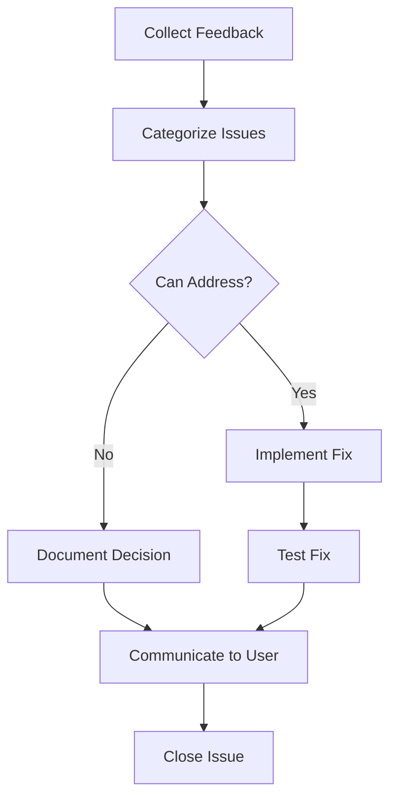

# Release Plan: v1.9.0 - Pre-v2.0.0 Polish

**Release Date:** August 2026 (Target: Week of Aug 11)
**Theme:** Final Testing, Documentation & Migration Tools
**Phase:** Phase 3 - Maturity
**Effort:** M (1-2 weeks)
**Risk Level:** Medium

## Overview

Final preparation release before v2.0.0. Focus on comprehensive testing, documentation polish, migration tooling, and addressing user feedback from v1.8.0 deprecation warnings. This release ensures a smooth transition to v2.0.0.

## Goals

1. **Primary Goal**: Comprehensive test coverage for v2.0.0 migration
2. **Secondary Goal**: Complete migration documentation and tooling
3. **Tertiary Goal**: Address all user feedback from v1.8.0

## Success Criteria

- [ ] 95%+ test coverage for migration paths
- [ ] All migration guides complete and reviewed
- [ ] Automated migration scripts tested
- [ ] User feedback issues resolved
- [ ] v2.0.0 release candidate ready

## Features & Improvements

### 1. Automated Migration Scripts
**Priority:** P0 | **Effort:** L (6 days)

Create scripts to automatically migrate configurations and recipes.

**Scripts:**
```bash
# Migrate recipes to v2.0.0 format
npx cyberchef-migrate recipes --input ./recipes --output ./recipes-v2

# Migrate configuration
npx cyberchef-migrate config --input .env --output config.json

# Validate migration
npx cyberchef-migrate validate --dir ./recipes-v2
```

**Implementation:**
```javascript
// scripts/migrate-recipes.mjs
import { readdir, readFile, writeFile } from 'fs/promises';
import { transformRecipeV2 } from './transformers.mjs';

async function migrateRecipes(inputDir, outputDir) {
  const files = await readdir(inputDir);
  const results = { success: 0, failed: 0, errors: [] };

  for (const file of files) {
    try {
      const recipe = JSON.parse(await readFile(`${inputDir}/${file}`, 'utf-8'));
      const migrated = transformRecipeV2(recipe);
      await writeFile(`${outputDir}/${file}`, JSON.stringify(migrated, null, 2));
      results.success++;
    } catch (err) {
      results.failed++;
      results.errors.push({ file, error: err.message });
    }
  }

  return results;
}
```

**Tasks:**
- [ ] Create recipe migration script
- [ ] Create configuration migration script
- [ ] Add validation commands
- [ ] Test with various input formats
- [ ] Add rollback capability

**Acceptance Criteria:**
- Migrates 100% of valid recipes
- Preserves all recipe semantics
- Reports errors clearly
- Provides rollback option

**GitHub Issue Template:**
```markdown
## Feature: Automated Migration Scripts

### Description
Create CLI scripts to automatically migrate recipes and configurations from v1.x to v2.0.0 format.

### Commands
- `npx cyberchef-migrate recipes` - Migrate recipe files
- `npx cyberchef-migrate config` - Migrate configuration
- `npx cyberchef-migrate validate` - Validate migrated files

### Tasks
- [ ] Implement recipe migrator
- [ ] Implement config migrator
- [ ] Add validation logic
- [ ] Create CLI interface
- [ ] Test with edge cases
- [ ] Document usage

### Success Criteria
- All valid recipes migrate successfully
- Clear error reporting
- Rollback available
```

---

### 2. Comprehensive Migration Documentation
**Priority:** P0 | **Effort:** M (5 days)

Complete documentation for v2.0.0 migration.

**Documentation Structure:**
```
docs/migration/
  README.md              # Migration overview
  v1-to-v2.md           # Detailed migration guide
  breaking-changes.md   # Full breaking changes list
  api-changes.md        # API-level changes
  recipes.md            # Recipe migration guide
  configuration.md      # Config migration guide
  troubleshooting.md    # Common issues & solutions
  rollback.md           # Rollback procedures
```

**Tasks:**
- [ ] Write migration overview
- [ ] Create step-by-step guides
- [ ] Document all API changes
- [ ] Add code examples (before/after)
- [ ] Create troubleshooting section
- [ ] Add rollback procedures
- [ ] Review with external users

**Acceptance Criteria:**
- Complete coverage of all changes
- Clear step-by-step instructions
- Code examples for all scenarios
- Tested by external reviewers

---

### 3. Migration Test Suite
**Priority:** P0 | **Effort:** M (5 days)

Comprehensive tests for migration paths.

**Test Categories:**
```javascript
describe('Migration Tests', () => {
  describe('Recipe Migration', () => {
    it('should migrate simple recipes', async () => {
      const v1Recipe = { op: 'To Base64', args: [] };
      const v2Recipe = migrateRecipe(v1Recipe);
      expect(v2Recipe.operation).toBe('base64_encode');
    });

    it('should migrate complex recipes with nested operations', async () => {
      // Test multi-step recipes
    });

    it('should preserve recipe semantics after migration', async () => {
      // Run same input through both and compare
    });
  });

  describe('Configuration Migration', () => {
    it('should migrate environment variables to config file', async () => {
      // Test config migration
    });
  });

  describe('Backward Compatibility', () => {
    it('should accept v1.x recipes in compatibility mode', async () => {
      // Test compatibility mode
    });
  });
});
```

**Tasks:**
- [ ] Create recipe migration tests (50+)
- [ ] Create config migration tests
- [ ] Add semantic preservation tests
- [ ] Test edge cases and errors
- [ ] Add performance regression tests
- [ ] Achieve 95%+ coverage

**Acceptance Criteria:**
- 95%+ test coverage for migration
- All edge cases covered
- Semantic preservation verified
- Performance benchmarked

---

### 4. User Feedback Resolution
**Priority:** P1 | **Effort:** M (4 days)

Address feedback from v1.8.0 deprecation warnings.

**Feedback Categories:**
1. Breaking change concerns
2. Migration timeline requests
3. Alternative API suggestions
4. Documentation improvements
5. Tooling requests

**Process:**


**Tasks:**
- [ ] Review all GitHub discussions
- [ ] Categorize feedback
- [ ] Prioritize addressable items
- [ ] Implement high-priority fixes
- [ ] Document decisions for deferred items
- [ ] Communicate resolutions

**Acceptance Criteria:**
- All feedback reviewed
- High-priority items addressed
- Decisions documented
- Users notified of resolutions

---

### 5. Release Candidate Preparation
**Priority:** P1 | **Effort:** S (3 days)

Prepare v2.0.0 release candidate.

**Tasks:**
- [ ] Create v2.0.0-rc.1 branch
- [ ] Enable v2.0.0 features by default
- [ ] Run full test suite
- [ ] Perform security audit
- [ ] Update version numbers
- [ ] Create pre-release on GitHub

**Release Candidate Checklist:**
- [ ] All tests passing
- [ ] No critical/high vulnerabilities
- [ ] Documentation complete
- [ ] Migration tools working
- [ ] Changelog updated
- [ ] Pre-release published

---

### 6. LTS Strategy Documentation
**Priority:** P2 | **Effort:** S (2 days)

Document long-term support plans for v1.x and v2.x.

**LTS Timeline:**
```
v1.x LTS:
  - Active support: Until v2.0.0 release
  - Security fixes: 6 months after v2.0.0
  - End of life: December 2026

v2.x LTS:
  - Active support: Until v3.0.0 release
  - Security fixes: 12 months after next major
  - Target EOL: 2028
```

**Tasks:**
- [ ] Define LTS policy
- [ ] Document support timeline
- [ ] Create backport procedure
- [ ] Communicate to users

---

## Breaking Changes

None. This is a preparation release.

## Dependencies

- v1.8.0 deprecation system
- User feedback from v1.8.0 release

## Testing Requirements

### Migration Testing
- [ ] Recipe migration accuracy (100%)
- [ ] Config migration accuracy (100%)
- [ ] Semantic preservation (100%)
- [ ] Rollback procedures

### Documentation Testing
- [ ] All examples work as documented
- [ ] Step-by-step guides validated
- [ ] External user review completed
- [ ] No broken links

### Release Candidate Testing
- [ ] Full test suite passes
- [ ] Performance benchmarks stable
- [ ] Security scan clean
- [ ] Docker image builds

## Documentation Updates

- [ ] Complete migration guide suite
- [ ] Update all API documentation
- [ ] Add LTS policy documentation
- [ ] Review and update all existing docs
- [ ] Create migration video tutorial (optional)

## Migration Guide

**For Users:**
1. Upgrade to v1.9.0
2. Run migration preview: `npx cyberchef-migrate validate`
3. Fix any reported issues
4. Run migration: `npx cyberchef-migrate recipes`
5. Test with v2.0.0-rc.1 (optional)
6. Provide final feedback

**For Developers:**
1. Review API changes documentation
2. Update client code for new APIs
3. Test against v2.0.0-rc.1
4. Report any issues

## Timeline

| Week | Focus | Deliverables |
|------|-------|--------------|
| Week 1 | Migration tools & docs | Scripts working, docs complete |
| Week 2 | Testing & RC prep | Full testing, RC published |

## Related Documents

- [Phase 3: Maturity](./phase-3-maturity.md)
- [v1.8.0 Release Plan](./release-v1.8.0.md)
- [v2.0.0 Release Plan](./release-v2.0.0.md)
- [ROADMAP.md](../ROADMAP.md)

## GitHub Milestone

Create milestone: `v1.9.0 - Pre-v2.0.0 Polish`

**Issues:**
1. Create Automated Migration Scripts (P0, L)
2. Complete Migration Documentation Suite (P0, M)
3. Implement Migration Test Suite (P0, M)
4. Address v1.8.0 User Feedback (P1, M)
5. Prepare v2.0.0 Release Candidate (P1, S)
6. Document LTS Strategy (P2, S)

---

**Last Updated:** December 2025
**Status:** Planning
