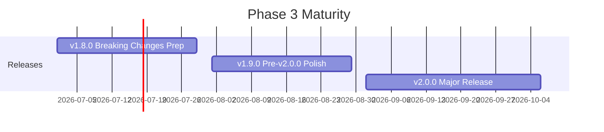

# Phase 3: Maturity (v1.8.0 - v2.0.0)

**Timeline:** July 2026 - September 2026 (Q3 2026)
**Focus:** Breaking Changes, API Stabilization, and Long-Term Maintainability
**Status:** Planning

## Overview

Phase 3 prepares for and executes a major version release with architectural improvements, enhanced type safety, and a refined API surface. This phase sets the foundation for sustained evolution and establishes a stable API contract.

## Strategic Objectives

1. **Breaking Changes**: Implement all planned API improvements
2. **API Stabilization**: Freeze API contract for v2.x lifecycle
3. **Long-Term Maintainability**: Establish maintenance and LTS strategy

## Releases in This Phase



### v1.8.0 - Breaking Changes Preparation
**Target:** Week of July 14, 2026
**Effort:** M (1-2 weeks)

Key deliverables:
- Deprecation warning system
- v2.0.0 breaking changes documentation
- Migration preview tool
- v2.0.0 compatibility mode (opt-in)
- User feedback collection

[Detailed Plan](./release-v1.8.0.md)

### v1.9.0 - Pre-v2.0.0 Polish
**Target:** Week of August 11, 2026
**Effort:** M (1-2 weeks)

Key deliverables:
- Automated migration scripts
- Comprehensive migration documentation
- Migration test suite (95%+ coverage)
- User feedback resolution
- v2.0.0 release candidate preparation
- LTS strategy documentation

[Detailed Plan](./release-v1.9.0.md)

### v2.0.0 - Major Release
**Target:** Week of September 8, 2026
**Effort:** XL (3-4 weeks)

Key deliverables:
- All breaking changes implemented
- Unified configuration system
- Enhanced recipe schema
- Structured error responses
- MCP protocol update
- Zod v4 type system
- Production-ready status

[Detailed Plan](./release-v2.0.0.md)

## Breaking Changes Summary

### Tool Naming Convention
| v1.x | v2.0.0 | Notes |
|------|--------|-------|
| `cyberchef_to_base64` | `base64_encode` | Simplified, optional prefix |
| `cyberchef_from_base64` | `base64_decode` | |
| `cyberchef_aes_encrypt` | `aes_encrypt` | |
| `cyberchef_bake` | `bake` | Both supported |

### Recipe Schema
```javascript
// v1.x
{ op: 'To Base64', args: ['A-Za-z0-9+/='] }

// v2.0.0
{
  operation: 'base64_encode',
  arguments: { alphabet: 'A-Za-z0-9+/=' },
  metadata: { version: '2.0.0' }
}
```

### Error Responses
```javascript
// v1.x
{ isError: true, content: [{ type: 'text', text: 'Error: Invalid input' }] }

// v2.0.0
{
  isError: true,
  error: {
    code: 'INVALID_INPUT',
    message: 'Input is not valid Base64',
    context: { position: 5 },
    suggestions: ['Check encoding']
  }
}
```

### Configuration System
```javascript
// v1.x: Environment variables
LOG_LEVEL=info
ENABLE_RATE_LIMITING=true

// v2.0.0: Unified config file
{
  "logging": { "level": "info" },
  "rateLimiting": { "enabled": true }
}
```

## Migration Strategy

### Phase 3 Migration Timeline
```
July 2026 (v1.8.0):
  - Deprecation warnings active
  - Users review affected APIs
  - Feedback collection begins

August 2026 (v1.9.0):
  - Migration scripts available
  - Users run migration preview
  - Test with compatibility mode

September 2026 (v2.0.0):
  - Breaking changes live
  - Migration complete
  - v1.x enters security-only mode
```

### Migration Tools
1. **cyberchef-migrate recipes** - Transform recipe files
2. **cyberchef-migrate config** - Convert env vars to config file
3. **cyberchef-migrate validate** - Check migration completeness

## Key Metrics and Success Criteria

### Migration Metrics
| Metric | Target | Measurement |
|--------|--------|-------------|
| Migration success rate | >95% | User reports |
| Migration tool coverage | 100% | Testing |
| Deprecation warning coverage | 100% | Code review |
| User feedback resolution | 90%+ | Issue tracking |

### Quality Metrics
| Metric | Target | Measurement |
|--------|--------|-------------|
| Test coverage | >90% | Coverage tools |
| CVE count | 0 critical/high | Trivy scan |
| API documentation | 100% | Documentation audit |
| Breaking change documentation | 100% | Review |

### Adoption Metrics
| Metric | Target | Measurement |
|--------|--------|-------------|
| v2.0.0 adoption (3 months) | 60%+ | Download stats |
| Migration issues | <10 critical | Issue tracker |
| User satisfaction | 4+/5 | Feedback survey |

## Technical Architecture (v2.0.0)

### API Layer
```
v2.0.0 API Architecture:
+----------------------------+
| MCP Protocol Layer         |
| - MCP 2026-xx-xx spec      |
| - Streaming support        |
+----------------------------+
| Validation Layer           |
| - Zod v4 schemas           |
| - Runtime type checking    |
+----------------------------+
| Tool Layer                 |
| - Simplified naming        |
| - Structured errors        |
+----------------------------+
| Recipe Engine              |
| - Enhanced schema          |
| - Composition support      |
+----------------------------+
| Core CyberChef             |
| - 300+ operations          |
| - Upstream sync            |
+----------------------------+
```

### Configuration Architecture
```
Configuration Hierarchy:
+----------------------------+
| Environment Variables      |  <- Highest priority
| (Override config file)     |
+----------------------------+
| Config File                |
| cyberchef-mcp.config.json  |
+----------------------------+
| Default Values             |  <- Lowest priority
| (Built-in defaults)        |
+----------------------------+
```

## Risk Assessment

### High-Risk Items
| Risk | Probability | Impact | Mitigation |
|------|-------------|--------|------------|
| Migration failures | Medium | High | Comprehensive testing, rollback |
| User resistance | Low | High | Clear communication, value prop |
| v1.x security issues | Low | High | 6-month security support period |

### Medium-Risk Items
| Risk | Probability | Impact | Mitigation |
|------|-------------|--------|------------|
| Incomplete deprecation | Medium | Medium | Audit all APIs |
| Documentation gaps | Medium | Medium | External review |
| Compatibility mode bugs | Low | Medium | Thorough testing |

## LTS Strategy

### v1.x End of Life Timeline
```
September 2026: v2.0.0 released
  - v1.x enters maintenance mode
  - Security fixes only
  - No new features

March 2027: v1.x End of Life
  - No more updates
  - Users must migrate to v2.x
  - Documentation archived
```

### v2.x Support Timeline
```
September 2026: v2.0.0 released
  - Active development
  - Feature additions
  - Regular releases

Until v3.0.0: Active support
  - Bug fixes
  - Security updates
  - Minor features

12 months after v3.0.0: Maintenance mode
  - Security fixes only

24 months after v3.0.0: End of life
```

## Documentation Requirements

### Required Documentation
- [ ] v2.0.0 Release Notes
- [ ] Complete Migration Guide
- [ ] API Reference (v2.0.0)
- [ ] Configuration Guide
- [ ] Recipe Schema Documentation
- [ ] Error Code Reference
- [ ] Troubleshooting Guide
- [ ] LTS Policy Document
- [ ] Changelog Update
- [ ] Security Policy Update

### Optional Documentation
- [ ] Blog post announcing v2.0.0
- [ ] Video migration tutorial
- [ ] FAQ update
- [ ] Community showcase

## Team and Resources

### Required Skills
- API design
- Documentation
- User communication
- Release management
- Security auditing

### Estimated Effort
| Release | Person-Days | Complexity |
|---------|-------------|------------|
| v1.8.0 | 7-10 | Medium |
| v1.9.0 | 7-10 | Medium |
| v2.0.0 | 15-21 | High |
| **Total** | **29-41** | **High** |

## Phase Exit Criteria

Before declaring Phase 3 complete:
- [ ] All breaking changes implemented
- [ ] Migration success rate >95%
- [ ] Zero critical/high CVEs
- [ ] API documentation 100% complete
- [ ] Migration guides reviewed externally
- [ ] LTS policy documented
- [ ] v1.x security support period started
- [ ] v2.0.0 announced to community

## Post-v2.0.0 Planning

### Immediate (v2.0.1 - v2.0.x)
- Bug fixes from v2.0.0
- Documentation improvements
- Minor UX enhancements

### Short-term (v2.1.0+)
- Plugin system exploration
- Additional integrations
- Performance improvements
- New operation support

### Long-term (v3.0.0)
- GraphQL-style query interface
- Distributed execution
- Multi-language bindings
- Cloud-native deployment

## Related Documents

- [v1.8.0 Release Plan](./release-v1.8.0.md)
- [v1.9.0 Release Plan](./release-v1.9.0.md)
- [v2.0.0 Release Plan](./release-v2.0.0.md)
- [Phase 1: Foundation](./phase-1-foundation.md)
- [Phase 2: Enhancement](./phase-2-enhancement.md)
- [ROADMAP](../ROADMAP.md)

---

**Last Updated:** December 2025
**Phase Status:** Planning
**Next Review:** After Phase 2 completion (June 2026)
