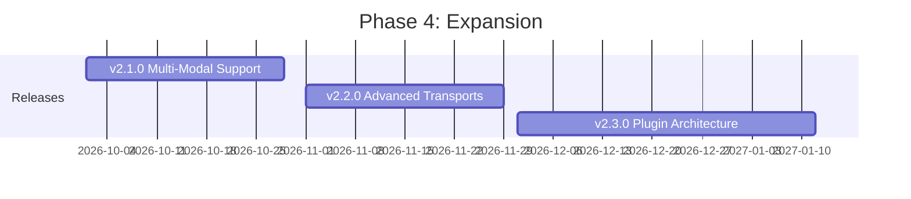

# Phase 4: Expansion (Q4 2026)

**Version Range:** v2.1.0 - v2.3.0
**Timeline:** October 2026 - December 2026
**Theme:** Extending Capabilities and Reach
**Total Effort:** 14 weeks

## Overview

Phase 4 focuses on expanding CyberChef MCP Server's capabilities beyond basic text processing to support multi-modal data, advanced transport protocols, and third-party extensibility. This phase transforms the server from a text-focused tool wrapper into a comprehensive data manipulation platform.

Building on the stable v2.0.0 foundation, Phase 4 delivers:
- Multi-modal support for images, audio, and binary data
- Modern transport protocols aligned with MCP specification evolution
- Plugin architecture enabling community-driven extensions

## Strategic Goals

1. **Multi-Modal Excellence**: Enable CyberChef's 50+ image/binary operations to work seamlessly through MCP
2. **Protocol Modernization**: Align with MCP 2025+ transport specifications (Streamable HTTP)
3. **Ecosystem Foundation**: Create plugin architecture for community contributions

## Release Schedule

| Release | Theme | Duration | Target Date |
|---------|-------|----------|-------------|
| v2.1.0 | Multi-Modal Support | 4 weeks | October 2026 |
| v2.2.0 | Advanced Transports | 4 weeks | November 2026 |
| v2.3.0 | Plugin Architecture | 6 weeks | December 2026 |

## Phase 4 Releases

### v2.1.0 - Multi-Modal Support

**Focus:** Enable binary data, image, and audio handling through MCP

The MCP specification (2025-06-18) explicitly supports multi-modal content including base64-encoded images and audio. CyberChef has numerous operations that work with binary data (image manipulation, audio processing, file format conversions) that currently cannot be effectively used through MCP.

**Key Features:**
- Base64 binary data encoding/decoding infrastructure
- Image input/output for visual operations (Extract EXIF, etc.)
- Audio data support for audio-related operations
- File attachment handling with MIME type detection
- Multi-modal response formatting per MCP spec
- Blob resource support for large binary data

**Technical Approach:**
- Implement `ImageContent` and `AudioContent` types per MCP spec
- Add automatic MIME type detection using magic bytes
- Create binary-aware tool input/output schemas
- Optimize base64 encoding for large files
- Add streaming support for large binary operations

**Success Criteria:**
- 50+ operations support binary I/O
- Handle files up to 100MB
- MIME type detection accuracy >99%
- Base64 encoding overhead <10% performance impact

### v2.2.0 - Advanced Transports

**Focus:** Implement modern MCP transport protocols

The MCP specification deprecated SSE transport in March 2025, replacing it with Streamable HTTP. Additionally, the community has requested WebSocket transport for real-time bidirectional communication. This release modernizes transport layer support.

**Key Features:**
- Streamable HTTP transport (per MCP spec 2025-03-26)
- WebSocket transport (community-requested, non-standard)
- SSE deprecation completion and removal
- Progress streaming for long-running operations
- Multi-client session management
- Transport auto-negotiation

**Technical Approach:**
- Implement Streamable HTTP per specification
- Add WebSocket transport as optional module
- Create transport abstraction layer for future protocols
- Implement session persistence across reconnections
- Add graceful degradation between transports

**Success Criteria:**
- 100% MCP spec compliance for Streamable HTTP
- WebSocket latency <10ms for local connections
- Session persistence across network interruptions
- Backward compatibility with stdio transport

### v2.3.0 - Plugin Architecture

**Focus:** Enable third-party operation extensions

A plugin architecture allows the community to extend CyberChef MCP Server without modifying core code. This is essential for specialized operations, domain-specific tools, and experimental features.

**Key Features:**
- Custom operation registration API
- Third-party operation package format (npm-compatible)
- Plugin discovery and dynamic loading
- Sandboxed execution using WebAssembly (optional)
- Plugin validation and security scanning
- Automatic documentation generation for plugins

**Technical Approach:**
- Define plugin manifest schema (package.json extension)
- Implement plugin loader with dependency resolution
- Create sandboxed runtime using WebAssembly/WASI
- Add plugin signing for verified publishers
- Build plugin validation suite
- Integrate with npm/yarn/pnpm ecosystems

**Success Criteria:**
- Plugin installation via npm
- Plugin execution isolation (no core access)
- 10+ community plugins within 3 months
- <100ms plugin loading overhead

## Technical Dependencies

### External Dependencies
- **MCP SDK 2.x**: Required for Streamable HTTP transport
- **WebAssembly/WASI**: For sandboxed plugin execution
- **Node.js 22+**: For ESM and modern APIs
- **Docker BuildKit**: For multi-platform builds

### Internal Prerequisites
- v2.0.0 stable release
- Comprehensive test suite (from Phase 3)
- CI/CD pipeline (from Phase 1)
- Security scanning (from Phase 1)

## Risk Assessment

| Risk | Probability | Impact | Mitigation |
|------|-------------|--------|------------|
| MCP spec changes | Medium | High | Track spec closely, abstraction layers |
| Plugin security vulnerabilities | High | Critical | Sandboxing, code signing, review process |
| WebSocket compatibility issues | Medium | Medium | Feature flags, graceful fallback |
| Performance regression from plugins | Medium | Medium | Resource limits, monitoring |

## Success Metrics

### Technical Metrics
- Multi-modal operation coverage: 50+ operations
- Transport protocol compliance: 100%
- Plugin ecosystem: 10+ community plugins
- Performance: <10% overhead for multi-modal

### Adoption Metrics
- Multi-modal usage: 30% of requests
- Streamable HTTP adoption: 80% of clients
- Plugin installations: 100+ cumulative
- Community contributions: 5+ plugin authors

## Key Deliverables

### Documentation
- Multi-modal usage guide
- Transport migration guide (SSE to Streamable HTTP)
- Plugin development guide
- Plugin security guidelines
- API reference updates

### Infrastructure
- Plugin registry infrastructure
- Plugin validation CI pipeline
- Multi-modal test suite
- Transport compatibility matrix

### Tooling
- Plugin scaffolding CLI (`npx create-cyberchef-plugin`)
- Plugin validator
- Binary data testing utilities
- Transport debugging tools

## Team Considerations

### Skills Required
- MCP protocol expertise
- WebAssembly/WASI experience
- Security architecture
- npm ecosystem knowledge

### Estimated Effort by Area
| Area | Effort |
|------|--------|
| Multi-Modal (v2.1.0) | 2-3 developers, 4 weeks |
| Transports (v2.2.0) | 2 developers, 4 weeks |
| Plugins (v2.3.0) | 3-4 developers, 6 weeks |
| Documentation | 1 technical writer, continuous |
| Testing/QA | 1-2 QA engineers, continuous |

## References

- [MCP Specification 2025-06-18](https://modelcontextprotocol.io/specification/2025-06-18/)
- [MCP Transports](https://modelcontextprotocol.io/specification/2025-06-18/basic/transports)
- [WebAssembly WASI](https://wasi.dev/)
- [Release v2.1.0 Plan](./release-v2.1.0.md)
- [Release v2.2.0 Plan](./release-v2.2.0.md)
- [Release v2.3.0 Plan](./release-v2.3.0.md)
- [Multi-Modal Strategy](./MULTI-MODAL-STRATEGY.md)
- [Plugin Architecture Design](./PLUGIN-ARCHITECTURE-DESIGN.md)

---

**Phase 4 Owner:** TBD
**Last Updated:** December 2025
**Status:** Planning
**Next Review:** September 2026 (post v2.0.0 release)
