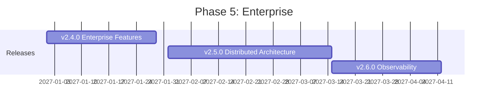

# Phase 5: Enterprise (Q1 2027)

**Version Range:** v2.4.0 - v2.6.0
**Timeline:** January 2027 - March 2027
**Theme:** Production-Ready Enterprise Features
**Total Effort:** 14 weeks

## Overview

Phase 5 transforms CyberChef MCP Server into an enterprise-grade platform suitable for production deployments in organizations with strict security, compliance, and operational requirements. This phase addresses the critical gaps that prevent adoption in enterprise environments.

Building on Phase 4's extensibility foundation, Phase 5 delivers:
- OAuth 2.1 authentication and role-based authorization
- Comprehensive audit logging for compliance
- Horizontal scaling with distributed architecture
- Full observability with OpenTelemetry integration

## Strategic Goals

1. **Enterprise Security**: OAuth 2.1 authentication aligned with MCP authorization specification (June 2025)
2. **Compliance Ready**: Audit logging meeting SOC 2, HIPAA, and GDPR requirements
3. **Production Scale**: Horizontal scaling supporting 1000+ concurrent operations
4. **Full Observability**: OpenTelemetry-based monitoring for production visibility

## Release Schedule

| Release | Theme | Duration | Target Date |
|---------|-------|----------|-------------|
| v2.4.0 | Enterprise Features | 4 weeks | January 2027 |
| v2.5.0 | Distributed Architecture | 6 weeks | February 2027 |
| v2.6.0 | Observability & Monitoring | 4 weeks | March 2027 |

## Phase 5 Releases

### v2.4.0 - Enterprise Features

**Focus:** Authentication, authorization, and audit logging

The MCP Authorization specification (finalized June 2025) establishes OAuth 2.1 as the standard for MCP server authentication. This release implements enterprise security features required for production deployments.

**Key Features:**
- OAuth 2.1 authentication per MCP spec
- Role-based authorization (RBAC)
- Fine-grained tool-level permissions
- Comprehensive audit logging
- Usage quotas and metering hooks
- API key management for service accounts
- Multi-tenancy foundation

**Technical Approach:**
- Implement MCP Resource Server role (per June 2025 spec)
- Integrate with external Authorization Servers (Keycloak, Auth0, Okta)
- Create permission model for operations and recipes
- Build structured audit log format (JSON, compatible with SIEM)
- Add quota tracking with configurable limits
- Implement tenant isolation for shared deployments

**Success Criteria:**
- OAuth 2.1 compliance per MCP spec
- <50ms authentication overhead
- Audit log completeness: 100% of operations logged
- Zero cross-tenant data leakage
- Integration with 3+ IdP providers (Keycloak, Auth0, Okta)

### v2.5.0 - Distributed Architecture

**Focus:** Horizontal scaling and high availability

Production deployments require horizontal scaling to handle variable loads and high availability to meet uptime SLAs. This release enables CyberChef MCP Server to run as a distributed service.

**Key Features:**
- Horizontal scaling with load balancing
- State management across instances
- Kubernetes deployment patterns (Helm chart)
- Docker Swarm deployment patterns
- Session affinity configuration
- Health check endpoints (liveness, readiness)
- Graceful shutdown handling
- Circuit breaker patterns

**Technical Approach:**
- Stateless server design (externalize session state to Redis)
- Kubernetes-native deployment with Helm
- Load balancer integration (ingress, service mesh)
- Implement BuildKit-based distributed builds
- Add warm pool support for fast startup
- Create autoscaling policies (HPA, KEDA)

**Success Criteria:**
- Linear scaling to 10+ replicas
- <1s cold start time (with warm pools)
- 99.9% uptime in production
- Zero message loss during scale events
- Kubernetes and Docker Swarm support

### v2.6.0 - Observability & Monitoring

**Focus:** Production visibility with OpenTelemetry

OpenTelemetry has become the industry standard for observability in 2025. This release provides comprehensive monitoring capabilities for production deployments.

**Key Features:**
- OpenTelemetry integration (traces, metrics, logs)
- Distributed tracing across operations
- Prometheus metrics endpoint
- Grafana dashboard templates
- Custom span instrumentation for operations
- Alerting integration hooks
- Performance profiling endpoints

**Technical Approach:**
- Implement OpenTelemetry SDK instrumentation
- Add auto-instrumentation for HTTP, MCP protocol
- Create custom spans for CyberChef operations
- Export to OTLP-compatible backends
- Build Prometheus scrape endpoint
- Create pre-built Grafana dashboards
- Add structured logging with trace correlation

**Success Criteria:**
- <5ms tracing overhead per operation
- Trace sampling configurability
- 100% request correlation (logs, traces, metrics)
- Pre-built dashboards for key metrics
- Integration with major backends (Jaeger, Datadog, New Relic)

## Technical Dependencies

### External Dependencies
- **MCP SDK 2.x**: OAuth 2.1 support
- **OpenTelemetry SDK**: Observability instrumentation
- **Redis/Valkey**: Session state storage
- **Kubernetes 1.28+**: For distributed deployment
- **Keycloak/Auth0/Okta**: Identity providers

### Internal Prerequisites
- Phase 4 completion (plugin architecture)
- Transport layer stability (v2.2.0)
- Multi-modal support (v2.1.0)

## Risk Assessment

| Risk | Probability | Impact | Mitigation |
|------|-------------|--------|------------|
| OAuth implementation vulnerabilities | Medium | Critical | Security audit, use proven libraries |
| State synchronization issues | High | High | Extensive testing, Redis clustering |
| Observability performance overhead | Medium | Medium | Configurable sampling, optimized export |
| Multi-tenancy data leakage | Low | Critical | Strict isolation, security testing |
| Kubernetes compatibility issues | Medium | Medium | Multi-version testing, Helm best practices |

## Success Metrics

### Technical Metrics
- Authentication latency: <50ms
- Audit log coverage: 100%
- Scaling efficiency: Linear to 10 replicas
- Tracing overhead: <5ms
- Uptime: 99.9%

### Adoption Metrics
- Enterprise deployments: 5+ production
- OAuth adoption: 80% of new deployments
- Dashboard usage: 50% of enterprises
- Community feedback: NPS >50

## Key Deliverables

### Documentation
- Enterprise deployment guide
- Security configuration guide
- OAuth integration guide
- Kubernetes deployment guide
- Observability setup guide
- Compliance documentation (SOC 2, HIPAA)

### Infrastructure
- Helm chart for Kubernetes
- Docker Compose for development
- Terraform modules (optional)
- Reference architecture diagrams

### Tooling
- Health check CLI
- Audit log analyzer
- Performance testing suite
- Load testing scripts

## Compliance Considerations

### SOC 2 Type II
- Audit logging with immutable storage
- Access control documentation
- Change management procedures
- Incident response documentation

### HIPAA
- PHI handling documentation
- Encryption at rest and in transit
- Access audit trails
- Business associate agreement template

### GDPR
- Data processing documentation
- Right to erasure support
- Data portability
- Privacy impact assessment template

## Team Considerations

### Skills Required
- Security architecture (OAuth, RBAC)
- Kubernetes/container orchestration
- OpenTelemetry/observability
- Enterprise software development
- Compliance (SOC 2, HIPAA, GDPR)

### Estimated Effort by Area
| Area | Effort |
|------|--------|
| Enterprise Features (v2.4.0) | 2-3 developers, 4 weeks |
| Distributed Architecture (v2.5.0) | 3-4 developers, 6 weeks |
| Observability (v2.6.0) | 2 developers, 4 weeks |
| Security Audit | External auditor, 2 weeks |
| Documentation | 1 technical writer, continuous |
| Testing/QA | 2 QA engineers, continuous |

## References

- [MCP Authorization Specification](https://modelcontextprotocol.io/docs/tutorials/security/authorization)
- [OAuth for MCP Patterns](https://blog.gitguardian.com/oauth-for-mcp-emerging-enterprise-patterns-for-agent-authorization/)
- [OpenTelemetry Node.js](https://opentelemetry.io/docs/languages/js/)
- [Kubernetes Best Practices](https://kubernetes.io/docs/concepts/cluster-administration/)
- [Release v2.4.0 Plan](./release-v2.4.0.md)
- [Release v2.5.0 Plan](./release-v2.5.0.md)
- [Release v2.6.0 Plan](./release-v2.6.0.md)
- [Enterprise Features Plan](./ENTERPRISE-FEATURES-PLAN.md)

---

**Phase 5 Owner:** TBD
**Last Updated:** December 2025
**Status:** Planning
**Next Review:** December 2026 (post Phase 4)
