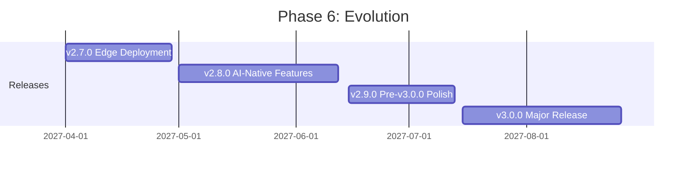

# Phase 6: Evolution (Q2-Q3 2027)

**Version Range:** v2.7.0 - v3.0.0
**Timeline:** April 2027 - August 2027
**Theme:** Optimization, AI Integration, and Major Release
**Total Effort:** 20 weeks

## Overview

Phase 6 represents the culmination of the v2.x series and preparation for v3.0.0. This phase focuses on three key areas: optimizing for resource-constrained edge environments, integrating AI-native features, and preparing a major version release with breaking changes.

Building on Phase 5's enterprise foundation, Phase 6 delivers:
- Edge-optimized deployment for ARM64 and minimal environments
- AI-native features including natural language to recipe translation
- Comprehensive v3.0.0 preparation and migration tooling
- Major version release with architectural improvements

## Strategic Goals

1. **Edge Excellence**: <50MB container images, <1s startup, ARM64-optimized
2. **AI Augmentation**: Natural language interfaces for operation discovery and recipe creation
3. **API Evolution**: v3.0.0 breaking changes for long-term maintainability
4. **Ecosystem Maturity**: Stable platform for community growth

## Release Schedule

| Release | Theme | Duration | Target Date |
|---------|-------|----------|-------------|
| v2.7.0 | Edge Deployment Optimization | 4 weeks | April 2027 |
| v2.8.0 | AI-Native Features | 6 weeks | May 2027 |
| v2.9.0 | Pre-v3.0.0 Polish | 4 weeks | June 2027 |
| v3.0.0 | Major Release | 6 weeks | August 2027 |

## Phase 6 Releases

### v2.7.0 - Edge Deployment Optimization

**Focus:** Minimal footprint for edge and resource-constrained environments

Edge computing and IoT deployments require minimal container sizes, fast startup times, and ARM64 support. This release optimizes CyberChef MCP Server for these environments.

**Key Features:**
- ARM64-native multi-platform builds
- Minimal container images (<50MB target)
- Offline operation mode (no network dependencies)
- Resource-constrained configuration profiles
- Startup time optimization (<1s cold start)
- Edge caching strategies
- Memory footprint optimization

**Technical Approach:**
- Multi-platform Docker builds (AMD64, ARM64, ARM/v7)
- Alpine-based minimal images with aggressive pruning
- Tree-shaking unused operations
- Lazy loading of operation modules
- Ahead-of-time compilation where beneficial
- Memory-mapped operation configs
- Connection pooling and resource reuse

**Success Criteria:**
- Container size: <50MB (currently ~200MB)
- Cold start: <1s (currently ~3s)
- ARM64 performance: 95% of AMD64
- Offline mode: 100% core operations functional
- Memory usage: <100MB baseline

### v2.8.0 - AI-Native Features

**Focus:** LLM-powered operation discovery and recipe generation

AI assistants are the primary consumers of MCP servers. This release adds AI-native features that leverage LLM capabilities to enhance the user experience.

**Key Features:**
- Context-aware operation suggestions
- Natural language to recipe translation
- Auto-recipe generation from input/output examples
- Operation chaining optimization
- Intelligent error correction suggestions
- LLM-powered operation documentation enhancement
- Recipe explanation and annotation

**Technical Approach:**
- Integration with function calling patterns
- Prompt engineering for recipe generation
- Example-based learning for recipe inference
- Operation similarity matching
- Error pattern recognition
- Documentation generation pipeline
- Optional external LLM integration (configurable)

**Success Criteria:**
- Recipe generation accuracy: >80% correct
- Operation suggestion relevance: >90%
- Error suggestion helpfulness: >70% user acceptance
- Feature adoption: 30% of users within 3 months
- Performance: <500ms for suggestions

### v2.9.0 - Pre-v3.0.0 Polish

**Focus:** Preparation for major version release

This release focuses on stabilization, deprecation warnings, and migration tooling in preparation for v3.0.0.

**Key Features:**
- Deprecation warnings for v3.0.0 breaking changes
- Migration validation tooling
- Comprehensive documentation updates
- Final API stabilization
- Performance optimization pass
- Security audit and fixes
- Compatibility mode for v2.x APIs

**Technical Approach:**
- Annotate all deprecated APIs with warnings
- Create `cyberchef-migrate` CLI tool
- Generate migration reports
- Update all documentation
- Profile and optimize hot paths
- Third-party security audit
- Implement compatibility layer

**Success Criteria:**
- 100% deprecated APIs have warnings
- Migration tool handles 95% of cases automatically
- Documentation coverage: 100%
- Performance: 10% improvement over v2.8.0
- Security: Zero critical vulnerabilities

### v3.0.0 - Major Release

**Focus:** Breaking changes for long-term sustainability

v3.0.0 introduces breaking changes that improve API design, performance, and maintainability for the next major version cycle.

**Key Features:**
- API v3 with streamlined design
- New tool naming conventions (optional prefix)
- Enhanced recipe schema v2
- MCP protocol 2027.xx compatibility
- Configuration system overhaul
- Type system enhancements
- Plugin API v2
- Removed deprecated v2.x APIs

**Breaking Changes:**

| Area | v2.x | v3.0.0 |
|------|------|--------|
| Tool naming | `cyberchef_to_base64` | `to_base64` (configurable) |
| Recipe schema | Array-based args | Named object args |
| Configuration | Environment variables | Unified config file |
| Error format | Simple text | Structured JSON |
| Plugin API | v1 | v2 (incompatible) |

**Technical Approach:**
- Implement all breaking changes behind feature flags
- Create comprehensive migration scripts
- Maintain v2.x LTS branch
- Update all dependencies to latest
- Rebuild documentation from scratch
- Full regression testing suite

**Success Criteria:**
- Migration success rate: >95%
- v2.x LTS maintenance for 12 months
- Performance parity or better than v2.9.0
- Zero critical bugs at launch
- User adoption: 80% within 6 months

## Technical Dependencies

### External Dependencies
- **MCP SDK 3.x**: For v3.0.0 protocol compatibility
- **Node.js 24**: LTS version in 2027
- **Docker BuildKit**: Multi-platform builds
- **LLM APIs**: For AI-native features (optional)

### Internal Prerequisites
- Phase 5 completion (enterprise features)
- Stable plugin ecosystem
- Comprehensive test suite
- Strong CI/CD pipeline

## Risk Assessment

| Risk | Probability | Impact | Mitigation |
|------|-------------|--------|------------|
| ARM64 compatibility issues | Medium | Medium | Extensive platform testing |
| AI feature hallucinations | High | Medium | Confidence scoring, fallbacks |
| Migration complexity | Medium | High | Comprehensive tooling, support |
| v3.0.0 adoption resistance | Medium | High | Extended v2.x LTS, gradual rollout |
| Breaking change oversight | Low | Critical | Migration testing, beta period |

## Success Metrics

### Technical Metrics
- Container size: <50MB
- Startup time: <1s
- AI accuracy: >80%
- Migration success: >95%
- v3.0.0 stability: <10 critical bugs in first month

### Adoption Metrics
- Edge deployments: 20% of total
- AI feature usage: 30% of users
- v3.0.0 adoption: 80% within 6 months
- Migration satisfaction: NPS >60

## Key Deliverables

### Documentation
- Edge deployment guide
- AI features guide
- v3.0.0 migration guide (comprehensive)
- v2.x to v3.0.0 breaking changes document
- v3.0.0 API reference
- Architecture documentation update

### Infrastructure
- Multi-platform build pipeline
- Edge-optimized container images
- v2.x LTS branch
- v3.0.0 release automation

### Tooling
- `cyberchef-migrate` CLI
- Migration validation suite
- AI recipe generator
- Edge profiling tools

## LTS Policy

### v2.x Long-Term Support

After v3.0.0 release (August 2027):
- **Security fixes**: 12 months (until August 2028)
- **Critical bug fixes**: 6 months (until February 2028)
- **No new features**: Feature freeze after v2.9.0
- **End of life**: August 2028

### v3.x Support

- **Active support**: Until v4.0.0 release
- **Security fixes**: 12 months after v4.0.0
- **Target end of life**: 2029

## Team Considerations

### Skills Required
- Container optimization
- ARM64 architecture
- LLM integration
- API design
- Migration tooling
- Technical writing

### Estimated Effort by Area
| Area | Effort |
|------|--------|
| Edge Optimization (v2.7.0) | 2 developers, 4 weeks |
| AI Features (v2.8.0) | 3 developers, 6 weeks |
| Pre-v3.0.0 (v2.9.0) | 2 developers, 4 weeks |
| v3.0.0 Release | 4 developers, 6 weeks |
| Documentation | 2 technical writers, continuous |
| Testing/QA | 2 QA engineers, continuous |
| Security Audit | External auditor, 2 weeks |

## References

- [Docker Multi-Platform Builds](https://docs.docker.com/build/building/multi-platform/)
- [Alpine Linux Optimization](https://alpinelinux.org/about/)
- [LLM Function Calling](https://platform.openai.com/docs/guides/function-calling)
- [Release v2.7.0 Plan](./release-v2.7.0.md)
- [Release v2.8.0 Plan](./release-v2.8.0.md)
- [Release v2.9.0 Plan](./release-v2.9.0.md)
- [Release v3.0.0 Plan](./release-v3.0.0.md)

---

**Phase 6 Owner:** TBD
**Last Updated:** December 2025
**Status:** Planning
**Next Review:** March 2027 (post Phase 5)
