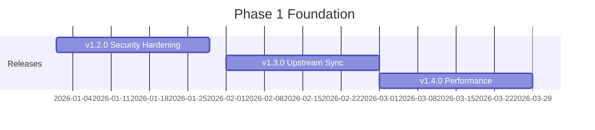

# Phase 1: Foundation (v1.2.0 - v1.4.0)

**Timeline:** January 2026 - March 2026 (Q1 2026)
**Focus:** Security, Reliability, and Operational Excellence
**Status:** Planning

## Overview

Phase 1 establishes production-ready infrastructure with enterprise-grade security, automated upstream synchronization, and performance optimization. This phase addresses the critical gaps preventing production deployment.

## Strategic Objectives

1. **Security Hardening**: Reduce container vulnerabilities by 95% through DHI migration
2. **Upstream Automation**: Detect and integrate CyberChef updates within 24 hours
3. **Performance Optimization**: Handle 100MB+ operations reliably

## Releases in This Phase



### v1.2.0 - Security Hardening
**Target:** Week of January 27, 2026
**Effort:** L (2 weeks)

Key deliverables:
- Docker Hardened Images migration
- Non-root user execution
- Security scanning in CI/CD (Trivy)
- SBOM generation
- Read-only filesystem configuration

[Detailed Plan](./release-v1.2.0.md)

### v1.3.0 - Upstream Sync Automation
**Target:** Week of February 24, 2026
**Effort:** XL (3-4 weeks)

Key deliverables:
- Upstream release monitoring (Renovate or GitHub Actions)
- Automated OperationConfig regeneration
- MCP tool validation suite
- Rollback mechanism
- Upstream merge workflow documentation

[Detailed Plan](./release-v1.3.0.md)

### v1.4.0 - Performance Optimization
**Target:** Week of March 24, 2026
**Effort:** L (2 weeks)

Key deliverables:
- Streaming API for large operations
- Worker threads for CPU-intensive operations
- Memory management optimization
- Performance benchmark suite
- Resource limits implementation

[Detailed Plan](./release-v1.4.0.md)

## Key Metrics & Success Criteria

### Security Metrics
| Metric | Current | Target | Measurement |
|--------|---------|--------|-------------|
| Container CVEs | ~16 | <10 | Trivy scan |
| Critical/High CVEs | 3 | 0 | Trivy scan |
| Non-root execution | No | Yes | Docker inspect |
| SBOM generation | No | Yes | Release artifacts |
| Security scan in CI | No | Yes | GitHub Actions |

### Operational Metrics
| Metric | Current | Target | Measurement |
|--------|---------|--------|-------------|
| Upstream detection | Manual | <24h | Monitoring alerts |
| Config regeneration | Manual | Automated | CI/CD pipeline |
| MCP tool validation | Limited | 300+ tools | Test suite |
| Update rollback | Manual | Automated | CI/CD pipeline |

### Performance Metrics
| Metric | Current | Target | Measurement |
|--------|---------|--------|-------------|
| Max input size | ~50MB | 100MB+ | Benchmark suite |
| Memory usage | Unbounded | <512MB | Process monitoring |
| Startup time | Unknown | <2s | Benchmark suite |
| Simple op latency | Unknown | <100ms | Benchmark suite |
| Complex op latency | Unknown | <5s | Benchmark suite |

## Dependencies & Prerequisites

### External Dependencies
- Docker Hardened Images availability for Node.js 22
- MCP SDK stability
- Upstream CyberChef compatibility
- Trivy GitHub Action

### Internal Prerequisites
- v1.1.0 release complete
- CI/CD pipeline working
- Core test suite passing
- Documentation infrastructure

## Technical Architecture Changes

### Security Architecture
```
Container Security Stack:
+----------------------------+
| Application Layer          |
| - Non-root user (UID 1001) |
| - Read-only filesystem     |
+----------------------------+
| Runtime Layer              |
| - Trivy scanning           |
| - SBOM generation          |
+----------------------------+
| Base Image Layer           |
| - Docker Hardened Image    |
| - Minimal attack surface   |
+----------------------------+
```

### Automation Architecture
```
Upstream Sync Flow:
+----------------+     +------------------+     +------------------+
| gchq/CyberChef | --> | Release Monitor  | --> | Sync Workflow    |
| GitHub Releases|     | Renovate/Actions |     | Branch Creation  |
+----------------+     +------------------+     +------------------+
                                                        |
+----------------+     +------------------+     +------------------+
| Merge to Main  | <-- | PR Approval      | <-- | Config Regen     |
| Release Image  |     | Human Review     |     | Validation Tests |
+----------------+     +------------------+     +------------------+
```

### Performance Architecture
```
Request Processing:
+----------------+     +------------------+     +------------------+
| MCP Request    | --> | Size Analysis    | --> | Routing          |
+----------------+     +------------------+     +------------------+
                              |                        |
                              v                        v
                    +------------------+     +------------------+
                    | Large Input      |     | Standard Input   |
                    | Streaming Mode   |     | Direct Mode      |
                    +------------------+     +------------------+
                              |                        |
                              v                        v
                    +------------------+     +------------------+
                    | Worker Thread    |     | Main Thread      |
                    | Pool (CPU-heavy) |     | (I/O-bound)      |
                    +------------------+     +------------------+
```

## Risk Assessment

### High-Risk Items
| Risk | Probability | Impact | Mitigation |
|------|-------------|--------|------------|
| DHI unavailable for Node 22 | Low | High | Fallback to distroless approach |
| Upstream breaking changes | Medium | High | Comprehensive test suite, version pinning |
| Performance regressions | Low | Medium | Benchmark suite, regression detection |

### Medium-Risk Items
| Risk | Probability | Impact | Mitigation |
|------|-------------|--------|------------|
| CI/CD complexity increase | Medium | Medium | Gradual rollout, documentation |
| Memory issues with streaming | Low | Medium | Thorough testing, fallback modes |
| Worker thread instability | Low | Medium | Pool management, error handling |

## Team & Resources

### Required Skills
- Docker/container security
- Node.js performance optimization
- GitHub Actions automation
- Testing and CI/CD

### Estimated Effort
| Release | Person-Days | Complexity |
|---------|-------------|------------|
| v1.2.0 | 10-14 | Medium |
| v1.3.0 | 15-20 | High |
| v1.4.0 | 10-14 | Medium |
| **Total** | **35-48** | **High** |

## Phase Exit Criteria

Before proceeding to Phase 2:
- [ ] Container has <10 known CVEs
- [ ] Upstream updates detected within 24h
- [ ] All 300+ MCP tools validated automatically
- [ ] 100MB operations processed successfully
- [ ] Performance benchmarks integrated in CI
- [ ] Documentation updated for all changes

## Related Documents

- [v1.2.0 Release Plan](./release-v1.2.0.md)
- [v1.3.0 Release Plan](./release-v1.3.0.md)
- [v1.4.0 Release Plan](./release-v1.4.0.md)
- [Upstream Sync Strategy](./UPSTREAM-SYNC-STRATEGY.md)
- [Security Hardening Plan](./SECURITY-HARDENING-PLAN.md)
- [ROADMAP](../ROADMAP.md)

---

**Last Updated:** December 2025
**Phase Status:** Planning
**Next Review:** January 2026
