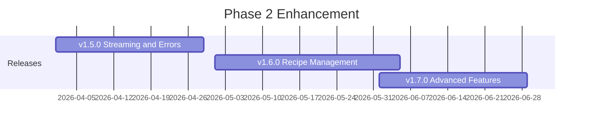

# Phase 2: Enhancement (v1.5.0 - v1.7.0)

**Timeline:** April 2026 - June 2026 (Q2 2026)
**Focus:** Advanced MCP Features and User Experience
**Status:** Planning

## Overview

Phase 2 extends MCP protocol capabilities with streaming support, recipe management, and batch processing. This phase transforms the server from a simple tool wrapper into a sophisticated data manipulation platform.

## Strategic Objectives

1. **Streaming Support**: Handle 1GB+ operations with progressive results
2. **Recipe Management**: Save, load, and share complex operation chains
3. **Enterprise Features**: Batch processing, telemetry, and rate limiting

## Releases in This Phase



### v1.5.0 - Streaming and Enhanced Error Handling
**Target:** Week of April 21, 2026
**Effort:** L (2 weeks)

Key deliverables:
- MCP streaming protocol support
- 1GB+ operation handling
- Enhanced error responses with context
- Structured JSON logging (Pino)
- Progress reporting

[Detailed Plan](./release-v1.5.0.md)

### v1.6.0 - Recipe Management
**Target:** Week of May 19, 2026
**Effort:** XL (3-4 weeks)

Key deliverables:
- Recipe storage and CRUD operations
- Import/export (JSON, YAML, URL)
- Recipe validation and testing
- Recipe library with 20+ examples
- Recipe composition (nested recipes)

[Detailed Plan](./release-v1.6.0.md)

### v1.7.0 - Advanced Features
**Target:** Week of June 16, 2026
**Effort:** L (2 weeks)

Key deliverables:
- Batch processing (100+ operations)
- Usage telemetry (opt-in)
- Rate limiting
- Result caching (LRU)
- Resource quotas

[Detailed Plan](./release-v1.7.0.md)

## Key Metrics and Success Criteria

### Streaming Metrics
| Metric | Current | Target | Measurement |
|--------|---------|--------|-------------|
| Max streaming size | N/A | 1GB+ | Integration tests |
| Memory during stream | Unbounded | Stable | Process monitoring |
| Progress updates | None | Every 10MB | Client tests |
| Streaming latency | N/A | <100ms first chunk | Benchmark |

### Recipe Management Metrics
| Metric | Current | Target | Measurement |
|--------|---------|--------|-------------|
| Recipe CRUD | None | Full support | API tests |
| Import formats | None | 4 (JSON, YAML, URL, CC) | Integration tests |
| Recipe library size | 0 | 20+ | Documentation |
| Recipe validation | None | 100% coverage | Validation tests |

### Enterprise Features Metrics
| Metric | Current | Target | Measurement |
|--------|---------|--------|-------------|
| Batch size | N/A | 100+ ops | Benchmark |
| Cache hit rate | N/A | 50%+ improvement | Telemetry |
| Rate limiting accuracy | N/A | 99%+ | Load tests |
| Telemetry overhead | N/A | <1% perf impact | Benchmark |

## New MCP Tools

### Streaming Tools
- Enhanced `cyberchef_bake` with streaming support
- Progress reporting via MCP metadata

### Recipe Management Tools
| Tool | Description |
|------|-------------|
| `cyberchef_recipe_create` | Save new recipe |
| `cyberchef_recipe_get` | Load recipe by ID |
| `cyberchef_recipe_list` | List recipes with filters |
| `cyberchef_recipe_update` | Update existing recipe |
| `cyberchef_recipe_delete` | Delete recipe |
| `cyberchef_recipe_execute` | Execute saved recipe |
| `cyberchef_recipe_export` | Export to JSON/YAML/URL |
| `cyberchef_recipe_import` | Import from various formats |
| `cyberchef_recipe_validate` | Validate recipe structure |

### Batch Processing Tools
| Tool | Description |
|------|-------------|
| `cyberchef_batch` | Execute multiple operations |
| `cyberchef_batch_status` | Check batch progress |

## Technical Architecture Changes

### Streaming Architecture
```
Streaming Request Flow:
+----------------+     +------------------+     +------------------+
| Large Request  | --> | Chunk Splitter   | --> | Streaming Proc   |
| >10MB          |     | 10MB chunks      |     | AsyncIterator    |
+----------------+     +------------------+     +------------------+
                                                        |
+----------------+     +------------------+     +------------------+
| MCP Client     | <-- | Streaming Trans  | <-- | Progress Events  |
| Progressive UI |     | WebStream API    |     | Every 10MB       |
+----------------+     +------------------+     +------------------+
```

### Recipe Management Architecture
```
Recipe System:
+----------------+     +------------------+     +------------------+
| Recipe CRUD    | --> | Validation Layer | --> | Storage Layer    |
| MCP Tools      |     | Zod Schemas      |     | SQLite/JSON      |
+----------------+     +------------------+     +------------------+
                              |
                              v
                    +------------------+
                    | Recipe Engine    |
                    | - Execution      |
                    | - Composition    |
                    | - Import/Export  |
                    +------------------+
```

### Batch and Caching Architecture
```
Batch Processing:
+----------------+     +------------------+     +------------------+
| Batch Request  | --> | Cache Lookup     | --> | Worker Pool      |
| 100+ ops       |     | LRU Cache        |     | Parallel Exec    |
+----------------+     +------------------+     +------------------+
        |                     |                        |
        v                     v                        v
+----------------+     +------------------+     +------------------+
| Rate Limiter   |     | Cache Update     |     | Result Agg       |
| Token Bucket   |     | TTL Management   |     | Error Handling   |
+----------------+     +------------------+     +------------------+
```

## Dependencies and Prerequisites

### External Dependencies
- MCP SDK with streaming support
- Pino (structured logging)
- SQLite (recipe storage) or JSON file backend
- LRU Cache library
- js-yaml (YAML support)

### Internal Prerequisites (from Phase 1)
- Container security hardened (v1.2.0)
- Upstream sync automated (v1.3.0)
- Performance optimized (v1.4.0)
- Worker threads implemented (v1.4.0)

## Risk Assessment

### High-Risk Items
| Risk | Probability | Impact | Mitigation |
|------|-------------|--------|------------|
| MCP streaming complexity | Medium | High | Thorough SDK research, fallback modes |
| Recipe schema changes | Low | High | Versioned schemas, migration |

### Medium-Risk Items
| Risk | Probability | Impact | Mitigation |
|------|-------------|--------|------------|
| Cache invalidation issues | Medium | Medium | Conservative TTL, manual invalidation |
| Rate limiting false positives | Low | Medium | Tunable thresholds, bypass mechanism |
| Telemetry privacy concerns | Medium | Medium | Opt-in only, anonymization |

## User Experience Improvements

### Error Messages (v1.5.0)
```javascript
// Before (v1.4.0)
"Error: Invalid Base64"

// After (v1.5.0)
{
  "code": "INVALID_INPUT",
  "message": "Input is not valid Base64",
  "context": { "position": 5, "char": "@" },
  "suggestions": [
    "Ensure input contains only Base64 characters (A-Z, a-z, 0-9, +, /, =)",
    "Use cyberchef_to_base64 to encode binary data first"
  ]
}
```

### Recipe Management (v1.6.0)
```javascript
// Save a recipe
await client.callTool({
  name: 'cyberchef_recipe_create',
  arguments: {
    name: 'Decrypt JWT',
    description: 'Decode and parse JWT tokens',
    operations: [
      { op: 'JWT Decode', args: {} },
      { op: 'JSON Beautify', args: { indentation: 2 } }
    ]
  }
});

// Execute saved recipe
await client.callTool({
  name: 'cyberchef_recipe_execute',
  arguments: {
    recipeId: 'uuid-here',
    input: 'eyJhbGciOiJIUzI1NiIsInR5cCI6IkpXVCJ9...'
  }
});
```

### Batch Processing (v1.7.0)
```javascript
// Process multiple inputs in parallel
await client.callTool({
  name: 'cyberchef_batch',
  arguments: {
    operations: [
      { tool: 'cyberchef_to_base64', arguments: { input: 'Hello' } },
      { tool: 'cyberchef_sha256', arguments: { input: 'World' } },
      { tool: 'cyberchef_md5', arguments: { input: 'Test' } }
    ],
    mode: 'parallel'
  }
});
```

## Team and Resources

### Required Skills
- MCP protocol and streaming
- Database design (SQLite)
- Caching strategies
- Telemetry and observability

### Estimated Effort
| Release | Person-Days | Complexity |
|---------|-------------|------------|
| v1.5.0 | 10-14 | Medium |
| v1.6.0 | 15-21 | High |
| v1.7.0 | 10-14 | Medium |
| **Total** | **35-49** | **High** |

## Phase Exit Criteria

Before proceeding to Phase 3:
- [ ] 1GB+ operations stream successfully
- [ ] Recipe CRUD fully functional
- [ ] 20+ example recipes in library
- [ ] Batch processing handles 100+ operations
- [ ] Rate limiting enforced correctly
- [ ] Cache improves response times by 50%+
- [ ] Telemetry collection working (opt-in)
- [ ] All documentation updated

## Related Documents

- [v1.5.0 Release Plan](./release-v1.5.0.md)
- [v1.6.0 Release Plan](./release-v1.6.0.md)
- [v1.7.0 Release Plan](./release-v1.7.0.md)
- [Phase 1: Foundation](./phase-1-foundation.md)
- [Phase 3: Maturity](./phase-3-maturity.md)
- [ROADMAP](../ROADMAP.md)

---

**Last Updated:** December 2025
**Phase Status:** Planning
**Next Review:** After Phase 1 completion (March 2026)
