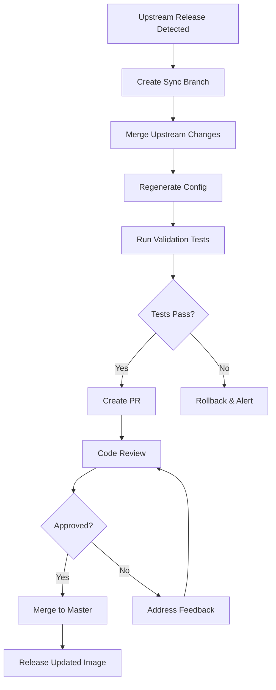

# Release Plan: v1.3.0 - Upstream Sync Automation

**Release Date:** February 2026 (Target: Week of Feb 24)
**Theme:** Automated CyberChef Upstream Synchronization
**Phase:** Phase 1 - Foundation
**Effort:** XL (3-4 weeks)
**Risk Level:** Medium

## Overview

Implement automated monitoring and synchronization with upstream gchq/CyberChef repository to ensure MCP server stays current with new operations, bug fixes, and security updates. This addresses the long-term maintenance challenge of keeping the fork synchronized.

## Goals

1. **Primary Goal**: Detect new CyberChef releases within 24 hours
2. **Secondary Goal**: Automatically create PRs with upstream changes
3. **Tertiary Goal**: Validate all MCP tools after upstream updates

## Success Criteria

- [ ] Renovate/Dependabot configured for CyberChef monitoring
- [ ] Automated PR creation on upstream release
- [ ] OperationConfig.json regeneration in CI
- [ ] Comprehensive test suite validates all tools
- [ ] Rollback mechanism tested and documented
- [ ] Zero manual intervention for patch/minor updates

## Features & Improvements

### 1. Upstream Release Monitoring
**Priority:** P0 (Critical)
**Effort:** M (5 days)

Monitor gchq/CyberChef for new releases using Renovate or GitHub Actions.

**Implementation Options:**

**Option A: Renovate (Recommended)**
```json
// renovate.json
{
  "extends": ["config:base"],
  "packageRules": [
    {
      "matchDatasources": ["github-releases"],
      "matchPackageNames": ["gchq/CyberChef"],
      "enabled": true,
      "schedule": ["after 10pm on sunday"]
    }
  ]
}
```

**Option B: GitHub Actions**
```yaml
name: Monitor Upstream
on:
  schedule:
    - cron: '0 0 * * *'  # Daily
jobs:
  check-upstream:
    runs-on: ubuntu-latest
    steps:
      - name: Check CyberChef Releases
        run: |
          # API call to gchq/CyberChef releases
          # Compare with current version
          # Create issue/PR if newer
```

**Tasks:**
- [ ] Research Renovate vs GitHub Actions approach
- [ ] Configure upstream monitoring (daily checks)
- [ ] Test detection of new releases
- [ ] Configure notification channels (Slack/Discord optional)
- [ ] Document monitoring architecture

**Acceptance Criteria:**
- New upstream release detected within 24 hours
- Monitoring runs automatically without failures
- Alerts visible in GitHub (issues or PRs)
- False positive rate <5%

**GitHub Issue Template:**
```markdown
## Feature: Upstream Release Monitoring

### Description
Implement automated monitoring of gchq/CyberChef releases to detect updates within 24 hours.

### Decision: Renovate vs GitHub Actions
**Recommendation:** Renovate
- Pros: Industry standard, handles multiple sources, rich PR descriptions
- Cons: External dependency, learning curve
- Alternative: GitHub Actions (more control, no external deps)

### Implementation
1. Add renovate.json configuration
2. Configure github-releases datasource
3. Set up notification preferences
4. Test with historical releases
5. Document monitoring process

### Success Criteria
- Detects new release within 24h
- Creates tracking issue or PR
- Zero manual intervention

### References
- https://docs.renovatebot.com/modules/manager/github-actions/
```

---

### 2. Automated OperationConfig Regeneration
**Priority:** P0 (Critical)
**Effort:** L (7 days)

Automatically regenerate OperationConfig.json when upstream changes are detected.

**Implementation:**
```yaml
# .github/workflows/upstream-sync.yml
name: Upstream Sync
on:
  pull_request:
    paths:
      - 'src/core/operations/**'
      - 'src/core/config/OperationConfig.json'

jobs:
  regenerate-config:
    runs-on: ubuntu-latest
    steps:
      - name: Checkout
        uses: actions/checkout@v4

      - name: Setup Node.js
        uses: actions/setup-node@v4
        with:
          node-version: '22'

      - name: Install Dependencies
        run: npm install

      - name: Regenerate Config
        run: npx grunt configTests

      - name: Apply Node 22 Patches
        run: |
          sed -i 's/new SlowBuffer/Buffer.alloc/g' node_modules/avsc/lib/types.js
          sed -i 's/SlowBuffer/Buffer/g' node_modules/buffer-equal-constant-time/index.js

      - name: Commit Changes
        run: |
          git config user.name "github-actions[bot]"
          git config user.email "github-actions[bot]@users.noreply.github.com"
          git add src/core/config/OperationConfig.json src/node/index.mjs
          git commit -m "chore: regenerate OperationConfig after upstream sync" || exit 0
          git push
```

**Tasks:**
- [ ] Create upstream-sync.yml workflow
- [ ] Implement config regeneration step
- [ ] Add validation step (check for breaking changes)
- [ ] Configure git commit automation
- [ ] Test with mock upstream changes

**Acceptance Criteria:**
- Config regenerates automatically on operation changes
- Generated files committed to PR
- No manual intervention required
- Workflow completes in <10 minutes

---

### 3. MCP Tool Validation Suite
**Priority:** P0 (Critical)
**Effort:** XL (10 days)

Create comprehensive test suite to validate all MCP tools after upstream updates.

**Implementation:**
```javascript
// tests/mcp-validation.test.mjs
import { describe, it, expect } from 'vitest';
import { StdioClientTransport } from '@modelcontextprotocol/sdk/client/stdio.js';
import { Client } from '@modelcontextprotocol/sdk/client/index.js';

describe('MCP Tool Validation', () => {
  let client;

  beforeAll(async () => {
    const transport = new StdioClientTransport({
      command: 'node',
      args: ['src/node/mcp-server.mjs']
    });
    client = new Client({ name: 'test-client', version: '1.0.0' }, {});
    await client.connect(transport);
  });

  describe('Core Tools', () => {
    it('should expose cyberchef_bake', async () => {
      const tools = await client.listTools();
      expect(tools.find(t => t.name === 'cyberchef_bake')).toBeDefined();
    });

    it('should expose cyberchef_search', async () => {
      const tools = await client.listTools();
      expect(tools.find(t => t.name === 'cyberchef_search')).toBeDefined();
    });
  });

  describe('All Operations', () => {
    it('should expose 300+ operation tools', async () => {
      const tools = await client.listTools();
      const opTools = tools.filter(t => t.name.startsWith('cyberchef_'));
      expect(opTools.length).toBeGreaterThan(300);
    });

    it('should validate all tool schemas', async () => {
      const tools = await client.listTools();
      for (const tool of tools) {
        expect(tool.name).toMatch(/^cyberchef_[a-z0-9_]+$/);
        expect(tool.description).toBeTruthy();
        expect(tool.inputSchema).toBeDefined();
      }
    });
  });

  describe('Sample Operations', () => {
    it('should execute To Base64', async () => {
      const result = await client.callTool({
        name: 'cyberchef_to_base64',
        arguments: { input: 'Hello' }
      });
      expect(result.content[0].text).toBe('SGVsbG8=');
    });

    it('should execute From Base64', async () => {
      const result = await client.callTool({
        name: 'cyberchef_from_base64',
        arguments: { input: 'SGVsbG8=' }
      });
      expect(result.content[0].text).toBe('Hello');
    });

    // Add 20+ more sample operations
  });

  describe('Breaking Change Detection', () => {
    it('should detect removed operations', async () => {
      // Compare current tool list with baseline
      // Flag if any tools missing
    });

    it('should detect changed schemas', async () => {
      // Compare schemas with baseline
      // Flag if required args changed
    });
  });
});
```

**Tasks:**
- [ ] Set up Vitest test framework
- [ ] Create MCP client test harness
- [ ] Implement tool listing validation
- [ ] Add 50+ operation execution tests
- [ ] Create schema regression tests
- [ ] Add breaking change detection
- [ ] Integrate into CI/CD pipeline
- [ ] Generate coverage reports

**Acceptance Criteria:**
- All 300+ tools validated for presence
- 50+ operations tested for correct output
- Schema validation passes for all tools
- Breaking changes detected automatically
- Test suite completes in <5 minutes
- >90% code coverage for mcp-server.mjs

**GitHub Issue Template:**
```markdown
## Testing: MCP Tool Validation Suite

### Description
Create comprehensive test suite to validate all MCP tools remain functional after upstream CyberChef updates.

### Scope
1. Tool presence validation (all 300+ tools)
2. Schema validation (Zod schemas correct)
3. Execution tests (50+ sample operations)
4. Breaking change detection
5. Regression prevention

### Technical Approach
- Use Vitest for async testing
- MCP SDK client for tool interaction
- Snapshot testing for schemas
- Baseline comparison for breaking changes

### Tasks
- [ ] Set up test framework
- [ ] Create MCP client harness
- [ ] Implement tool listing tests
- [ ] Add operation execution tests (50+)
- [ ] Create schema regression tests
- [ ] Add breaking change detection
- [ ] CI/CD integration
- [ ] Coverage reporting

### Success Criteria
- 300+ tools validated
- 50+ ops tested
- <5min runtime
- >90% coverage
- Integrated in CI

### Effort
XL (10 days)
```

---

### 4. Rollback Mechanism
**Priority:** P1 (High)
**Effort:** M (4 days)

Implement automated rollback if upstream changes break MCP tools.

**Implementation:**
```yaml
# Workflow logic
- name: Run Validation Tests
  id: validation
  run: npm test
  continue-on-error: true

- name: Rollback on Failure
  if: steps.validation.outcome == 'failure'
  run: |
    git reset --hard HEAD~1
    gh pr comment -b "Validation failed. Rolling back changes."
    gh pr close
```

**Tasks:**
- [ ] Define rollback criteria (test failures)
- [ ] Implement git revert automation
- [ ] Create notification system
- [ ] Test rollback mechanism
- [ ] Document rollback procedures

**Acceptance Criteria:**
- Rollback triggers on test failure
- Original state restored automatically
- Notifications sent to maintainers
- PR closed with explanation
- Manual investigation initiated

---

### 5. Upstream Merge Workflow
**Priority:** P1 (High)
**Effort:** L (6 days)

Document and automate the process of merging upstream changes.

**Workflow:**


**Tasks:**
- [ ] Document merge workflow
- [ ] Create merge conflict resolution guide
- [ ] Implement automated merge attempts
- [ ] Add conflict detection
- [ ] Create manual intervention procedures

**Acceptance Criteria:**
- Automated merge for 80% of updates
- Clear documentation for manual steps
- Conflict resolution guide complete
- Tested with multiple scenarios

---

## Breaking Changes

None. This release enhances automation without changing APIs.

## Dependencies

- Renovate or GitHub Actions (for monitoring)
- Vitest (for testing)
- MCP SDK Client (for validation)
- GitHub API token (for automation)

## Testing Requirements

### Upstream Monitoring Tests
- [ ] Detects new release within 24h
- [ ] Creates appropriate GitHub artifacts
- [ ] No false positives
- [ ] Handles rate limiting

### Config Regeneration Tests
- [ ] Regenerates on operation changes
- [ ] Applies Node 22 patches
- [ ] Commits changes correctly
- [ ] No git conflicts

### Validation Suite Tests
- [ ] All tools validated
- [ ] Sample operations execute
- [ ] Breaking changes detected
- [ ] Performance acceptable (<5min)

### Integration Tests
- [ ] End-to-end upstream update flow
- [ ] Rollback mechanism
- [ ] Notification system
- [ ] PR creation and merge

## Documentation Updates

- [ ] Add docs/planning/UPSTREAM-SYNC-STRATEGY.md (detailed)
- [ ] Update CONTRIBUTING.md with sync process
- [ ] Add troubleshooting guide
- [ ] Document Renovate/Actions configuration
- [ ] Update architecture.md with sync flow

## Migration Guide

No user migration required. This is internal automation.

**For Maintainers:**
1. Review renovate.json or workflow configuration
2. Set up GitHub token if needed
3. Configure notification preferences
4. Test sync workflow manually once

## Rollback Plan

If automation causes issues:
1. Disable Renovate or workflow temporarily
2. Revert to manual upstream monitoring
3. Fix automation issues in separate branch
4. Re-enable with thorough testing

## Timeline

| Week | Focus | Deliverables |
|------|-------|--------------|
| Week 1 | Monitoring setup | Renovate configured, detects releases |
| Week 2 | Config regeneration | Automated regeneration working |
| Week 3 | Validation suite | 50+ tests passing |
| Week 4 | Integration & docs | End-to-end flow, documentation |

## Related Documents

- [UPSTREAM-SYNC-STRATEGY.md](./UPSTREAM-SYNC-STRATEGY.md) (detailed strategy)
- [Phase 1: Foundation](./phase-1-foundation.md)
- [v1.2.0 Release Plan](./release-v1.2.0.md)
- [v1.4.0 Release Plan](./release-v1.4.0.md)

## GitHub Milestone

Create milestone: `v1.3.0 - Upstream Sync Automation`

**Issues to Create:**
1. Configure Upstream Release Monitoring (P0, M)
2. Implement Automated Config Regeneration (P0, L)
3. Create MCP Tool Validation Suite (P0, XL)
4. Implement Rollback Mechanism (P1, M)
5. Document Upstream Merge Workflow (P1, L)
6. Set Up Notification System (P2, S)
7. Create Troubleshooting Guide (P2, M)

---

**Last Updated:** December 2025
**Status:** Planning
**Next Review:** After v1.2.0 release
