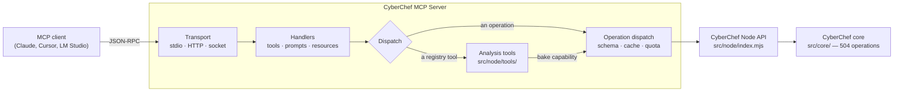
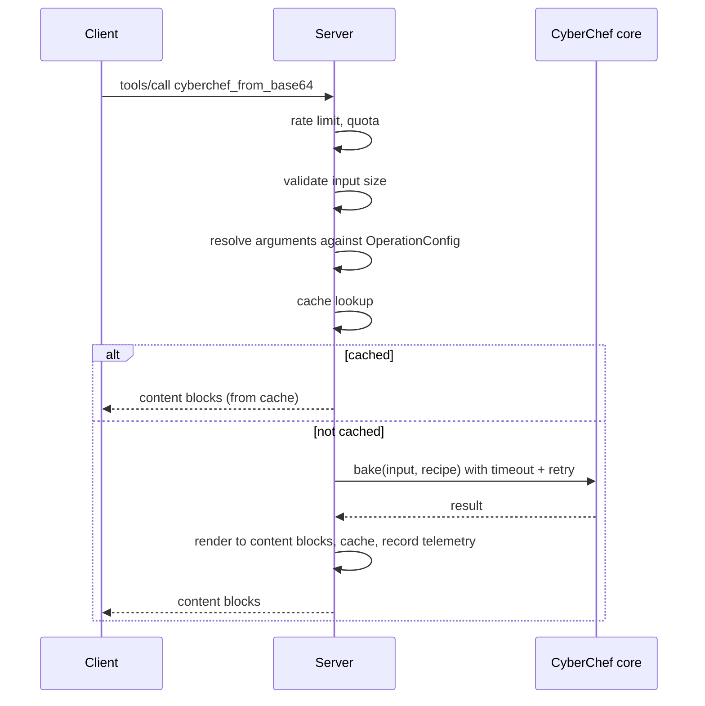

# Architecture

## The shape of it

Two things in that diagram carry most of the design:

**The registry tools receive a capability, not the engine.** They are handed `{ bake }` and nothing
else, which is what makes "what can a tool reach" answerable by reading one line rather than by
auditing every tool.

**Dispatch checks the registry first**, but only because registration *guarantees* the two sets are
disjoint — it throws on a collision with any operation or meta-tool name. The order therefore
cannot change an answer, which is the property that matters: otherwise which `cyberchef_aes_decrypt`
you got would depend on module load order.

## The files that matter

| Path | What it is |
|---|---|
| `src/node/mcp-server.mjs` | Composition root — protocol handlers, tool registration, dispatch |
| `src/node/lib/**` | The fork-owned subsystems: cache, quota, telemetry, rate limit, batch, tool schema, prompts, resources |
| `src/node/tools/**` | The [analysis tools](Analysis-Tools) and their registry |
| `src/node/transports.mjs` | stdio, Streamable HTTP, socket; era routing |
| `src/node/index.mjs` | **Generated** by Grunt — the Node API bridge |
| `src/core/**` | **Upstream CyberChef**, mirrored verbatim. Never hand-edited |
| `src/core/config/OperationConfig.json` | **Generated** — operation metadata |
| `patches/fork/*.patch` | The nine changes this fork makes to upstream code |

The two generated files are gitignored. `npx grunt configTests` produces them, and nothing runs
without it — see **[Installation](Installation)**.

## How a call becomes an answer

Results are rendered through the same `toContentBlocks` path whether they come from the cache or
not. That is not an aesthetic choice: when the cache returned raw values instead, the first call to
`cyberchef_generate_qr_code` produced an `image` block and every later call produced text.

## Why the tool surface is an index

`tools/list` goes to the model on every request. See **[The Tool Surface](Tool-Surface)** — the
short version is 4,900 tokens instead of 100,000, with nothing made unreachable.

## What the fork owns

Everything under `src/node/` except six upstream-owned files (`api.mjs`, `apiUtils.mjs`, `File.mjs`,
`NodeDish.mjs`, `NodeRecipe.mjs`, `repl.mjs`), plus `tests/mcp/`, the workflows, and the docs.

Everything under `src/core/` belongs to upstream and is mirrored verbatim. Changes to it live as
patches. See **[Fork & Upstream](Fork-and-Upstream)**.

## Design decisions with written records

| | |
|---|---|
| [ADR 0002](https://github.com/doublegate/CyberChef-MCP/blob/master/docs/adr/0002-tool-registry-is-not-a-plugin-loader.md) | Why there is no plugin loader — `node:vm` is not a security boundary, measured |
| [The SafeRegex incident](https://github.com/doublegate/CyberChef-MCP/blob/master/docs/security/2026-08-30-saferegex-reverted-by-upstream-sync.md) | Why fork changes are patches and never hand edits |
| [Findings logs](https://github.com/doublegate/CyberChef-MCP/tree/master/docs/internal) | What was measured during each release, including what the plan got wrong |
